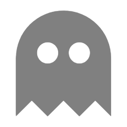

<b>Home Assistant</b> - Tools und Erweiterungen
 
<ul>
<li><a href="https://github.com/migacode/home-assistant/tree/main/spooky">Spooky&nbsp;&nbsp;Anwesenheits-Simulation</a></li>
<li><a href="https://github.com/migacode/home-assistant/tree/main/dwd">DWD-Warnungen anzeigen und versenden</a></li>
<li><a href="https://github.com/migacode/home-assistant/tree/main/nina">NINA-Warnungen anzeigen und versenden</a></li>
<li><a href="https://github.com/migacode/home-assistant/tree/main/themes">Coole dunkle und helle Themen</a></li>
</ul>
