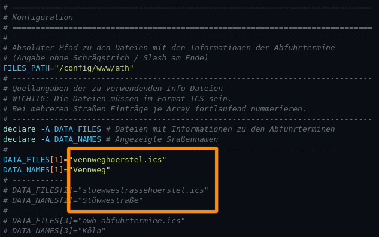
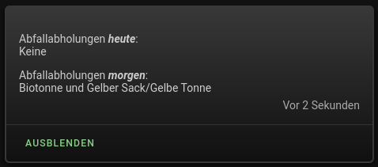

<h1>Home Assistant // AbfuhrTerminHinweise (ATH)</h1>

Mit diesem Tool können Abfuhrtermine für Abfall und jede beliebige andere Entsorgung überwacht, und automatisiert Hinweise auf eine am Folgetag anstehende Abfuhr versendet werden.
Die Einrichtung dieses Tools ist in wenigen einfachen Schritten erledigt. Zur Vorbereitung sind in Home Assistant lediglich drei einfache Sensoren anzulegen und die zugehörigen Dateien zu kopieren.
Danach können die gewünschten Funktionen und Erweiterungen mit Hilfe dieser Sensoren zur Verfügung gestellt werden.<br />
<h2>Vorbereitung</h2>
1.) Datei(en) mit Abfuhrinformationen von gewünschtem Anbieter herunterladen (ICS-Format)<br />
Beispiel: https://www.egst.de/de/abfallabholung -> <i>MEINESTRASSE.ics</i><br />
(<i>MEINESTRASSE</i> durch eigenen Dateinamen ersetzen)<br />
<br />
2.) In Home Assistant einen Ordner anlegen<br />
In der <b>Konsole</b> eingeben: <b>mkdir -p /config/www/ath</b><br />
Anstelle von <i>/config/www/ath</i> kann auch ein beliebiger anderer Pfad gewählt werden, dann müssen jedoch auch alle nachstehenden Auftreten sowie die Pfadangaben in der Datei <i>ath.sh</i>, sowie ggf. die Zugriffsrechte auf diesen Pfad entsprechend geändert werden.<br />
<br />
3.) Folgende Dateien in den Ordner <b>/config/www/ath</b> kopieren:<ul>
<li>Das Sensor-Skript&nbsp;&raquo;&nbsp;<a href="https://github.com/migacode/home-assistant/blob/main/ath/code/ath.sh"><strong>ath.sh</strong></a></li>
<li>Die heruntergeladene Datei <i>MEINESTRASSE.ics</i> (<i>MEINESTRASSE</i> durch eigenen Dateinamen ersetzen)</li>
<li>Gegebenenfalls auf Wunsch weitere ICS-Dateien mit Abfuhrinformationen</li>
</ul>
<br />
4.) In der Datei <b>ath.sh</b> die Konfiguration anpassen<ul>
<li>Bei den Einträgen für <b>DATA_FILES</b> die Dateiname(n) gemäß der(n) zuvor heruntergeladenen Datei(en) eintragen</li>
<li>Bei den Einträgen für <b>DATA_NAMES</b> die entsprechend gewünschte(n) Anzeige-Name(n) anpassen</li>
</ul>

Wenn mehr als eine Straße konfiguriert wird, müssen die entsprechenden Zeilen natürlich noch auskommentiert und ggf. mit weiteren fortlaufenden Nummern erweitert werden.<br />
<br />
5.) Das Sensor-Skript (Datei) <b>ath.sh</b> ausführbar machen<br />
In der <b>Konsole</b> eingeben: <b>chmod +x /config/www/ath/ath.sh</b><br />
<br />
6.) Die <b>Command-Line-Sensoren</b> für Home Assistant einrichten<br />
In der <b>configuration.yaml</b> folgende Sensoren anlegen:

```yaml
command_line:
  - sensor:
      command: "/config/www/ath/ath.sh"
      name: ath_morgen
      scan_interval: 600
  - sensor:
      command: "/config/www/ath/ath.sh -h"
      name: ath_heute
      scan_interval: 600
  - sensor:
      command: "/config/www/ath/ath.sh -n"
      name: ath_naechste
      scan_interval: 600
```
und Home Assistant <b>neu starten</b> um die Sensoren zu aktivieren.<br />

<h3>Das Sensor-Skript kann jedoch noch viel mehr!</h3>
Die Ausgabe des Skripts <b>ash.sh</b> lässt sich über verschiedene Parameter einstellen, so dass sich damit sehr einfach ganz individuelle Abfragen und Sensoren erstellen lassen.<br />
<br />
<b>Syntax:</b> ath.sh [Zeit] [Optionen] [Filter]<br />
<br />
<i>Zeiten</i> (nur einzeln zu verwenden):<br />
<code>
 -h&nbsp;&nbsp;&nbsp;&nbsp;&nbsp;sucht nach Terminen heute<br />
 -m&nbsp;&nbsp;&nbsp;&nbsp;&nbsp;sucht nach Terminen morgen (Default ohne Angabe einer Option)<br />
 -n&nbsp;&nbsp;&nbsp;&nbsp;&nbsp;sucht nach den nächsten Terminen ab morgen<br />
</code>
<i>Optionen</i><br />
<code>
 -s Index&nbsp;&nbsp;&nbsp;&nbsp;&nbsp;sucht nur in der Straße mit dem Index (1 .. n wie in DATA_FILES)<br />
 -d Datum&nbsp;&nbsp;&nbsp;&nbsp;&nbsp;sucht beginnend mit diesem Datum (Format: TTMM) statt morgen<br />
</code>
<br />
<i>Filter</i> ist eine beliebige Zeichenfolge (ohne Leerzeichen und mindestens 3 Zeichen lang), die in der Abfuhrart vorkommen soll<br />
<h3>Beispiele</h3>
<b>Beispiel 1:</b> ath.sh -m<br />
sucht für alle Straßen nach allen Abfuhrarten am morgigen Tag<br />
<br />
<b>Beispiel 2:</b> ath.sh -h papier<br />
sucht für alle Straßen nach einer Abfuhr der Papiertonne am heutigen Tag<br />
<br />
<b>Beispiel 3:</b> ath.sh -n -s 1 -d 0107 bio<br />
sucht nur für die Straße mit dem Index 1 nach dem ersten Termin zur Abfuhr der Biotonne ab dem 01.07. des laufenden Jahres<br />

<hr>
<h2>Erweiterungen für die Anzeige von Abfuhrterminen in Home Assistant</h2><ul>
<li><a href="#automation">Native Automatisierung zum Versenden von Hinweisen an Telegram<sup>1</sup>, HA-App<sup>2</sup> und Dashboard</a></li>
<li><a href="#nodered">NodeRED-Flow zum Versenden von Hinweisen an Telegram<sup>1</sup>, HA-App<sup>2</sup> und Dashboard</a></li>
<li><a href="#dashboard">Dashboard-(Lovelace-)Karte zur Anzeige von Abfuhrterminen in Home Assistant</a></li>
</ul>
(1) Für den Versand von Benachrichtigungen an Telegram muss die entsprechende <a href="https://www.home-assistant.io/integrations/telegram">Telegram-Integration</a> natürlich zuvor eingerichtet sein.<br />
(2) Ebenso erfolgt der Versand an die HA-App natürlich auch nur, wenn diese auf dem/n Endgerät/en installiert und eingerichtet ist.<br />

<a id="automation"></a>
<hr>
<h3>Automatisierung zum Versenden von Hinweisen an Telegram, HA-App und Dashboard (native)</h3>

<b>Quelltext</b>&nbsp;&raquo;&nbsp;<a href="https://github.com/migacode/home-assistant/blob/main/ath/code/ATH_automation.yaml"><strong>ATH_automation.yaml</strong></a><br />
<br />
Den Quelltext wie folgt anpassen und vollständig in die <b>automations.yaml</b> kopieren.<br />
<br />

1. An den markierten Stellen bei Bedarf die Uhrzeit und Entitäts-Namen der Benachrichtigungs-Dienste jeweils durch die eigenen ersetzen.<br />
Selbstverständlich muss man auch nicht alle Kanäle nutzen - wer keine Benachrichtigung an Telegram, die HA-App oder das Dashboard wünscht, kann in dem Bereich <i>action:</i> die Zeilen für den jeweiligen Service einfach löschen.<br />
<br />
2. Nicht vergessen bei den Entwicklerwerkzeugen die Konfiguration zu prüfen und Automatisierungen neu zu laden :)<br />
<br />

<a id="nodered"></a>
<hr>
<h3>NodeRED-Flow zum Versenden von Hinweisen an Telegram, HA-App und Dashboard</h3>

<b>Download</b> NodeRED-Flow&nbsp;&raquo;&nbsp;<a href="https://github.com/migacode/home-assistant/blob/main/ath/code/ATH_nodered_flow_1.10.json"><strong>ATH_nodered_flow_1.10.json</strong></a><br />
<br />
Den Quelltext/Flow in NodeRED importieren und wie folgt anpassen.<br />
<ul>
<li>Im Node 1 bei Bedarf eine andere Uhrzeit einstellen.</li>
<li>In den Nodes 3.a bis 3.d jeweils den Service-Namen für die Benachrichtigung durch den eigenen ersetzen.</li>
</ul>
Selbstverständlich muss man auch nicht alle Kanäle nutzen - wer keine Benachrichtigung an Telegram, die HA-App oder das Dashboard wünscht, kann den entsprechenden Node einfach löschen oder deaktivieren.<br /><br />
Der Flow ist im Standard so konfiguriert, dass er jeden Abend um 18:00 Uhr prüft, ob es am nächsten Tag Abfuhrtermine gibt, und wenn dies so ist, entsprechende Benachrichtigungen versendet.
Darüber hinaus enthält der Flow über den Button "Jetzt abfragen" auch die Möglichkeit, jederzeit eine Benachrichtigung über den aktuellen Status zu versenden.<br />

<a id="dashboard"></a>
<hr>
<h3>Dashboard-(Lovelace-)Karte zur Anzeige von Abfuhrterminen in Home Assistant</h3>

<b>Quelltext</b>&nbsp;&raquo;&nbsp;<a href="https://github.com/migacode/home-assistant/blob/main/ath/code/ATH_dashboard_card.yaml"><strong>ATH_dashboard_card.yaml</strong></a><br />
<br />
Den Quelltext als neue Karte (manuell über YAML-Code einfügen) im Dashboard anlegen.<br />
<br />
Die Karte verwendet das HACS-Modul "card-mod", jedoch nur zur Justierung von Abständen. Wer card-mod nicht verwendet, oder wem die Karte unformatiert besser gefällt, der kann die entsprechenden Style-Angaben problemlos entfernen.<br />
<br />
<hr>
