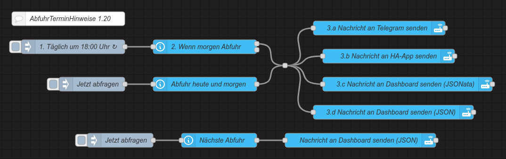

<h1>Home Assistant // AbfuhrTerminHinweise (ATH)</h1>

Mit diesem Tool können Abfuhrtermine für Abfall und jede beliebige andere Entsorgung überwacht, und automatisiert Hinweise auf eine am Folgetag anstehende Abfuhr versendet werden.
Die Einrichtung dieses Tools ist in wenigen einfachen Schritten erledigt. Zur Vorbereitung sind in Home Assistant lediglich zwei Sensoren anzulegen und die zugehörigen Dateien zu kopieren.
Danach können die gewünschten Funktionen und Erweiterungen mit Hilfe dieser Sensoren zur Verfügung gestellt werden.<br />
<br />
1.) Datei(en) mit Abfuhrinformationen herunterladen (ICS-Format)<br />
Beispiel: https://www.egst.de/de/abfallabholung -> "<i>MEINESTRASSE</i>.ics"<br />
(<i>MEINESTRASSE</i> durch eigenen Dateinamen ersetzen)

2.) In Home Assistant Ordner anlegen<br />
In der <b>Konsole</b> eingeben: mkdir -p /config/www/ath<br />
<b>HIINWEIS:</b> Anstelle von <i>/config/www/ath</i> kann auch ein beliebiger anderer Pfad gewählt werden, dann müssen jedoch auch alle nachstehenden Auftreten sowie die Pfadangaben in der Datei "ath.sh", sowie ggf. die Zugriffsrechte auf diesen Pfad entsprechend geändert werden.<br />

3.) Folgende Dateien in den Ordner /config/www/ath kopieren
- <a href="https://github.com/migacode/home-assistant/blob/main/ath/code/ath.sh"><strong>ath.sh</strong></a><br />
- <i>MEINESTRASSE</i>.ics (<i>MEINESTRASSE</i> durch eigenen Dateinamen ersetzen)<br />
- ggf. weitere ICS-Dateien mit Abfuhrinformationen

4.) In der Datei <b>ath.sh</b> die Konfiguration anpassen
- Bei den Einträgen für <b>DATA_FILES</b> die Dateiname(n) gemäß der(n) zuvor heruntergeladenen Datei(en) eintragen<br />
- Bei den Einträgen für <b>DATA_NAMES</b> die entsprechend angezeigte(n) Name(n) anpassen<br />
Wenn mehr als eine Straße konfiguriert wird, müssen die entsprechenden Zeilen noch auskommentiert und ggf. mit weiteren fortlaufenden Nummern erweitert werden.<br />

5.) Datei <b>ath.sh</b> ausführbar machen<br />
In der <b>Konsole</b> eingeben: chmod +x /config/www/ath/ath.sh<br />

6.) <b>Command-Line-Sensoren</b> für Home Assistant einrichten<br />
In der <b>configuration.yaml</b> folgende Sensoren anlegen:
```yaml
command_line:
  - sensor:
      command: "/config/www/ath/ath.sh"
      name: ath_morgen
      scan_interval: 60
  - sensor:
      command: "/config/www/ath/ath.sh -h"
      name: ath_heute
      scan_interval: 60
```
und Home Assistant neu starten um die Sensoren zu aktivieren.

<hr>
<h2>Erweiterungen für die Anzeige von Abfuhrterminen in Home Assistant</h2><ul>
<!-- <li><a href="#automation">Native Automatisierung zum Versenden von DWD-Warnungen an Telegram<sup>1</sup>, HA-App<sup>2</sup> und Dashboard</a></li> -->
<li><a href="#nodered">NodeRED-Flow zum Versenden von Hinweisen an Telegram<sup>1</sup>, HA-App<sup>2</sup> und Dashboard</a></li>
<li><a href="#dashboard">Dashboard-(Lovelace-)Karte zur Anzeige von Abfuhrterminen in Home Assistant</a></li>
</ul>
(1) Für den Versand von Benachrichtigungen an Telegram muss die entsprechende <a href="https://www.home-assistant.io/integrations/telegram">Telegram-Integration</a> natürlich zuvor eingerichtet sein.<br />
(2) Ebenso erfolgt der Versand an die HA-App natürlich auch nur, wenn diese auf dem/n Endgerät/en installiert und eingerichtet ist.<br />


<a id="nodered"></a>
<hr>
<h3>NodeRED-Flow zum Versenden von Hinweisen an Telegram, HA-App und Dashboard</h3>

<b>Download</b> NodeRED-Flow&nbsp;&raquo;&nbsp;<a href="https://github.com/migacode/home-assistant/blob/main/ath/code/ATH_nodered_flow_1.00.json"><strong>ATH_nodered_flow_1.00.json</strong></a><br />
<br />
Den Quelltext/Flow in NodeRED importieren und wie folgt anpassen.<br />
In den Nodes 3.a bis 3.d jeweils den Service-Namen für die Benachrichtigung durch den eigenen ersetzen.<br />
Selbstverständlich muss man auch nicht alle Kanäle nutzen - wer keine Benachrichtigung an Telegram, die HA-App oder das Dashboard wünscht, kann den entsprechenden Node einfach löschen oder deaktivieren.<br />
<br />

<a id="dashboard"></a>
<hr>
<h3>Dashboard-(Lovelace-)Karte zur Anzeige von Abfuhrterminen in Home Assistant</h3>

<b>Quelltext</b>&nbsp;&raquo;&nbsp;<a href="https://github.com/migacode/home-assistant/blob/main/ath/code/ATH_dashboard_card.yaml"><strong>ATH_dashboard_card.yaml</strong></a><br />
<br />
