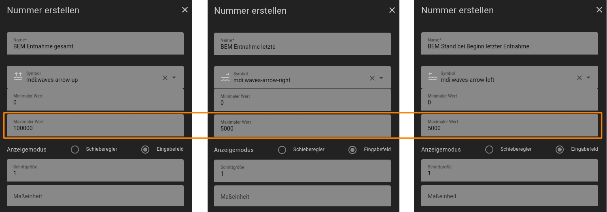

<h1>Home Assistant // BEM - Behälter-Entnahme-Messung</h1>

<b>BEM</b> ist eine einfache Automatisierung für Home Assistant zur Erfassung von Entnahmemengen aus beliebigen Behältern wie beispielsweise Wassertanks. Dabei wird vorausgesetzt, dass der Behälter bereits über einen Sensor verfügt, welcher den aktuellen Füllstand des Behälters misst, und dieser in Home Assistant bereits als entsprechende Sensor-Entität eingerichtet ist.<br />
<b>BEM</b> speichert dann fortwährend bei jeder Entnahme die letzte entnommene sowie die über einen beliebigen Zeitraum hinweg insgesamt entnommene Menge, und stellt beide Werte in Home Assistant zur Verfügung.<br />
Dazu verwendet <b>BEM</b> nur die Standard-Funktionen von Home Assistant und ggf. NodeRED, es werden keine zusätzlichen Integrationen, Add-Ons, HACS-Module oder NodeRED-Paletten (und auch kein Funktions-Node mit JavaScript ;) benötigt. Darüber hinaus sind in dem NodeRED-Flow-Paket auch Einzel-Flows zur Anzeige und zum Zurücksetzen der jeweiligen Werte enthalten.
<hr>
<h2>Vorbereitung</h2>
Zur Ausführung benötigt <b>BEM</b> neben einem beliebigen bereits eingerichteten Füllstandsensor die folgenden Helfer, welche zunächst in Home Assistant angelegt werden müssen.<br /><br />

<b>1.</b> Als Erstes den Helfer "<b>BEM Stand aktuell</b>" (sensor.bem_stand_aktuell) als Typ <b>Template</b> <i>für einen Sensor</i> anlegen. Dieser Helfer stellt eine Kopie des Wertes des realen Sensors zur Verfügung, dessen Entitäts-ID wie folgt in das Feld "Zustandstemplate" einzutragen ist - einfach 'sensor.EIGENE_SENSOR_ENTITÄTS_ID' gegen die Entitäts-ID des eigenen realen Sensors ersetzen. Dies vereinfacht zudem die Einrichtung von <b>BEM</b>, da so nur an dieser einen Stelle die ID des realen Sensors eingetragen werden muss, sämtliche Funktionen von <b>BEM</b> mit dem Template-Sensor arbeiten und sich auf diese Weise sogar Simulationen durchführen lassen, da der tatsächliche Stand des Behälters dadurch nicht verändert wird.<br /><br />

<b>2.</b> Danach den Helfer "<b>BEM Entnahme Status</b>" (input_boolean.bem_entnahme_status) als Typ <b>Schalter</b> anlegen, welcher den aktuellen Status der Entnahme speichert, so dass darüber eine Steuerung und Absicherung des Entnahmeverlaufs erfolgen kann.<br /><br />
<b>3.</b> Die folgenden Helfer dienen der Berechnung und Speicherung von Entnahmemengen und müssen somit als Typ <b>Nummer</b> (<i>input_number</i>) angelegt werden.<br />
<b>Wichtig</b>: Bei diesen Helfern ist in dem Feld für den maximalen Wert ein geeigneter Wert gemäß den eigenen Gegebenheiten einzutragen (in dem Beispiel unten enthält der Behälter 5000 Liter und die Gesamtmenge aller Entnahmen kann bis zu 100000 Liter betragen).<br />
<ul>
<li> "<b>BEM Entnahme gesamt</b>" (input_number.bem_entnahme_gesamt)</li>
<li> "<b>BEM Entnahme letzte</b>" (input_number.bem_entnahme_letzte)</li>
<li> "<b>BEM Stand bei Beginn letzter Entnahme</b>" (input_number.bem_stand_bei_beginn_letzter_entnahme)</li>
</ul>


<hr>
<h2>BEM (Varianten)</h2><ul>
<li>Eine Automatisierung von <b>BEM</b> steht aktuell nur als <a href="#nodered_flow">NodeRED-Flow</a> zur Verfügung.</li>
<li>Allerdings kann die Steuerung auch manuell mit der <a href="#dashboard_card">interaktiven Dashboard-Karte</a> erfolgen.</li>
</ul>

<a id="nodered_flow"></a>
<hr>
<h3>NodeRED-Flow</h3>

<b>Download</b> NodeRED-Flow&nbsp;&raquo;&nbsp;<a href="https://github.com/migacode/home-assistant/blob/main/bem/code/bem_nodered_flow_1.30.json"><strong>bem_nodered_flow_1.30.json</strong></a><br />
<br />
Den Quelltext/Flow einfach in NodeRED importieren. Sofern die zuvor bei der Vorbereitung aufgelisteten Helfer alle korrekt eingerichtet sind, ist hier keine weitere Anpassung mehr erforderlich - außer natürlich, dass die Trigger (Inject-Nodes) der Flows 1. und 2. mit eigenen Ereignissen (bspw. das Starten und Stoppen einer Pumpe) verbunden werden müssen. Aber auch ohne diese Verbindungen können die Flows direkt über die jeweiligen Inject-Buttons manuell verwendet werden.<br />

<hr>
<h3>Handhabung und Funktionsweise</h3>
Ein Messvorgang besteht <b>immer aus zwei Schritten</b> - einer Messung des Füllstandes zu Beginn und einer Messung zum Ende jeder Entnahme.<br />
Die beiden Schritte werden entsprechend durch die Automatisierungs-Flows 1. (Entnahme Beginn) und 2. (Entnahme Ende) abgebildet.<br />
In <b>Flow 1</b> wird der zum Zeitpunkt dessen Aufrufs gemessene Füllstand des Behälters in dem Helfer <b>bem_stand_bei_beginn_letzter_entnahme</b> gespeichert.
In <b>Flow 2</b> wird der aktuelle Füllstand des Behälters erneut eingelesen und die Differenz zu dem in Flow 1 gemessenen und gespeicherten Stand ermittelt. Die ermittelte Differenz (letzte Entnahmemenge) dann in dem Helfer <b>bem_entnahme_letzte</b> gespeichert, sowie der Gesamtentnahmemenge hinzu addiert. Die neue Gesamtentnahmemenge wird wiederrum in dem Helfer <b>bem_entnahme_gesamt</b> gespeichert. Insofern muss vor Beginn <b>jeder</b> Entnahme der Flow 1, sowie nach dem Ende der Entnahme Flow 2 getriggert werden - beispielsweise parallel zum Ein- bzw. Ausschalten einer Pumpe.<br /><br />
<b>Optional</b> kann der Flow 2 (Ende der Entnahme) auch mit dem <b>Simulations-Button</b> getriggert werden, wodurch eine zufällige Entnahmemenge erzeugt und gespeichert wird - der reale Füllstand bleibt dabei unverändert.<br /><br />
<b>Hinweis:</b> Ein Aufruf von Flow 2 ohne vorherigen Aufruf von Flow 1 führt natürlich dazu, dass Flow 2 den gespeicherten Füllstand noch von vor der/n vorletzten Entnahme/n als Basiswert verwendet, die Messung insofern auch die vorletzte/n Entnahmemenge/n mehrfach beinhaltet und somit auch die Werte der entnommenen Einzel- und Gesamtmenge verfälscht! Daher wird bei Start jedes Flows der Status der Entnahme überprüft und die weitere Verarbeitung entsprechend des Status abgebrochen oder fortgeführt.<br />

<a id="dashboard_card"></a>
<hr>
<h3>Interaktive Dashboard-Karte</h3>
Die nachstehende Dashboard-Karte enthält diverse Funktionen zur Anzeige und Steuerung von <b>BEM</b>:
<ul>
<li>Anzeige des Behälterfüllstandes in absoluter und prozentualer Wertigkeit</li>
<li>Anzeige der Einzel- und Gesamt-Entnahmemengen in verschiedenen Einheiten</li>
<li>Visuelle Anzeige zur Überwachung des aktuellen Entnahmestatus</li>
<li>Buttons zur manuellen Steuerung des Entnahmestatus (mit Sicherheitsabfrage)</li>
<li>Button zum Zurücksetzen aller Zähler (mit Sicherheitsabfrage)</li>
</ul>
Für die Berechnung der Entnahmemengen spielt es übrigens keine Rolle, ob der Entnahmestatus automatisiert aus den NodeRED-Flows oder manuell über diese Karte gesteuert wird - sogar eine gemischte Verwendung ist möglich.<br /><br />

<b>Download</b> Dashboard-Karte&nbsp;&raquo;&nbsp;<a href="https://github.com/migacode/home-assistant/blob/main/bem/code/bem_dashboard_card_1.30.yaml"><strong>bem_dashboard_card_1.30.yaml</strong></a><br />
<br />
Den Quelltext als neue Karte (manuell über YAML-Code einfügen) im Dashboard anlegen, darin die maximale Inhaltsmenge des Behälters (der Wert max: 5000) durch die maximale Füllmenge des realen Behälters ersetzen und die Werte für die Gewichtung der Gauge-Anzeigen (severity) gemäß den eigenen Wünschen an die realen Gegebenheiten anpassen.<br />
Zudem sind nachstehende Erweiterungen in Home Assistant hinzufügen.<br />
<br />
<b>Erforderliche Erweiterung 1 für interaktive Dashboard-Karte:</b><br />
Zur besseren Darstellung der Messwerte (Rundung etc.) verwendet die Karte zusätzliche Sensoren. Um diese anzulegen sind die folgenden Zeilen in der <b>configuration.yaml</b> unter dem Bereich <b>template:</b> hinzuzufügen.<br />
<b>Achtung:</b> Die Kapazität in den Formeln für die prozentualen Angaben der Füllstände (der Wert <i>5000</i>) muss an die Größe (Fassungsvermögen/maximaler Füllstand) des eigenen Behälters angepasst werden.<br />
Nachstehenden Code kopieren oder downloaden&nbsp;&raquo;&nbsp;<a href="https://github.com/migacode/home-assistant/blob/main/bem/code/bem_templates_1.30.yaml"><strong>bem_templates_1.30.yaml</strong></a>.<br />

```yaml
# =============================================================================
# Behälter-Entnahme-Messung (BEM) - Templates
# Version: 1.30
# -----------------------------------------------------------------------------
# Einbindung in der configuration.yaml unter den Bereich "template:"
# ACHTUNG: Bei Auslagerung in eine Include-Datei die Einrückung anpassen :|
# =============================================================================
# -----------------------------------------------------------------------------
# Angaben gerundet
# -----------------------------------------------------------------------------
  - sensor:
    - name: "BEM Entnahme gesamt gerundet"
      state: "{{ states('input_number.bem_entnahme_gesamt') | round(0) }}"

  - sensor:
    - name: "BEM Entnahme letzte gerundet"
      state: "{{ states('input_number.bem_entnahme_letzte') | round(0) }}"

  - sensor:
    - name: "BEM Stand aktuell gerundet"
      state: "{{ states('sensor.bem_stand_aktuell') | float | round(0) }}"

# -----------------------------------------------------------------------------
# Angaben in m³
# -----------------------------------------------------------------------------
  - sensor:
    - name: "BEM Entnahme gesamt in m3"
      state: "{{ (states('input_number.bem_entnahme_gesamt') | float / 1000) | round(2) }}"

  - sensor:
    - name: "BEM Entnahme letzte in m3"
      state: "{{ (states('input_number.bem_entnahme_letzte') | float / 1000) | round(2) }}"

  - sensor:
    - name: "BEM Stand aktuell in m3"
      state: "{{ (states('sensor.bem_stand_aktuell') | float / 1000) | round(2) }}"

# -----------------------------------------------------------------------------
# Prozentuale Angaben
# -----------------------------------------------------------------------------
# ACHTUNG: In den Formeln für die prozentualen Angaben des Füllstandes ist der
# maximale Füllstand des eigenen Behälters (hier der Wert 5000) einzutragen.
# -----------------------------------------------------------------------------
  - sensor:
    - name: "BEM Entnahme letzte prozentual"
      state: "{{ ((states('input_number.bem_entnahme_letzte') | float) / 5000 * 100) | round(2) }}"

  - sensor:
    - name: "BEM Stand aktuell prozentual"
      state: "{{ ((states('sensor.bem_stand_aktuell') | float) / 5000 * 100) | round(2) }}"
```

<br />
<b>Erforderliche Erweiterung 2 für interaktive Dashboard-Karte:</b><br />
Da die "action"-Sequenzen von Dashboard-Buttons leider (noch?) keine Templates unterstützen, müssen wir uns diesbezüglich mit zusätzlichen Skripten behelfen. Dazu sind die folgenden Zeilen in der <b>configuration.yaml</b> unter dem Bereich <b>script:</b> hinzuzufügen.<br />
Nachstehenden Code kopieren oder downloaden&nbsp;&raquo;&nbsp;<a href="https://github.com/migacode/home-assistant/blob/main/bem/code/bem_scripts_1.30.yaml"><strong>bem_scripts_1.30.yaml</strong></a>.<br />

```yaml
# =============================================================================
# Behälter-Entnahme-Messung (BEM) - Scripts
# Version: 1.30
# -----------------------------------------------------------------------------
# Einbindung in der configuration.yaml unter dem Bereich "script:"
# ACHTUNG: Bei Auslagerung in eine Include-Datei die Einrückung anpassen :|
# =============================================================================
# -----------------------------------------------------------------------------
# Entnahme Beginn
# -----------------------------------------------------------------------------
  bem_entnahme_beginn:
    alias: BEM - Entnahme Beginn
    description: ""
    sequence:
      - service: input_number.set_value
        continue_on_error: true
        target:
          entity_id: input_number.bem_stand_bei_beginn_letzter_entnahme
        data:
          value: "{{ states('sensor.bem_stand_aktuell') | float }}"
      - service: input_boolean.turn_on
        continue_on_error: true
        target:
          entity_id: input_boolean.bem_entnahme_status
# -----------------------------------------------------------------------------
# Entnahme Ende
# -----------------------------------------------------------------------------
  bem_entnahme_ende:
    alias: BEM - Entnahme Ende
    variables:
      letzte_gesamt: "{{ states('input_number.bem_entnahme_gesamt') | float }}"
      stand_beginn: "{{ states('input_number.bem_stand_bei_beginn_letzter_entnahme') | float }}"
      stand_ende: "{{ states('sensor.bem_stand_aktuell') | float }}"
    description: ""
    sequence:
      - service: input_boolean.turn_off
        continue_on_error: true
        target:
          entity_id: input_boolean.bem_entnahme_status
      - service: input_number.set_value
        continue_on_error: true
        target:
          entity_id: input_number.bem_entnahme_letzte
        data:
          value: "{{ (stand_beginn - stand_ende) | float }}"
      - service: input_number.set_value
        continue_on_error: true
        target:
          entity_id: input_number.bem_entnahme_gesamt
        data:
          value: "{{ (letzte_gesamt + stand_beginn - stand_ende) | float }}"
# -----------------------------------------------------------------------------
# Entnahme Zufall
# -----------------------------------------------------------------------------
  bem_entnahme_zufall:
    alias: BEM - Entnahme Zufall
    variables:
      zufall: "{{ (range(100, 10000) | random | float) / 100 }}"
      letzte_gesamt: "{{ states('input_number.bem_entnahme_gesamt') | float }}"
      stand_beginn: "{{ states('input_number.bem_stand_bei_beginn_letzter_entnahme') | float }}"
      stand_ende: "{{ (states('sensor.bem_stand_aktuell') | float) + zufall }}"
    description: ""
    sequence:
      - service: input_boolean.turn_off
        continue_on_error: true
        target:
          entity_id: input_boolean.bem_entnahme_status
      - service: input_number.set_value
        continue_on_error: true
        target:
          entity_id: input_number.bem_entnahme_letzte
        data:
          value: "{{ zufall }}"
      - service: input_number.set_value
        continue_on_error: true
        target:
          entity_id: input_number.bem_entnahme_gesamt
        data:
          value: "{{ (letzte_gesamt + zufall) | float }}"
```

<br />
