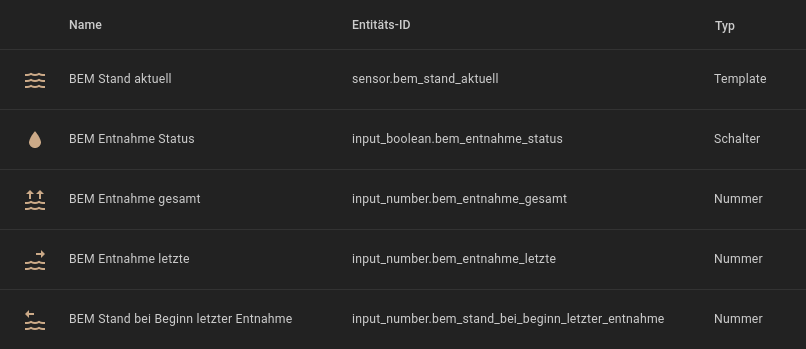

<h1>Home Assistant // BEM - Behälter-Entnahme-Messung</h1>

<b>BEM</b> ist eine einfache Automatisierung für Home Assistant zur Erfassung von Entnahmemengen aus beliebigen Behältern wie beispielsweise Wassertanks. Dabei wird vorausgesetzt, dass der Behälter bereits über einen Sensor verfügt, welcher den aktuellen Füllstand des Behälters misst, und dieser in Home Assistant bereits als entsprechende Sensor-Entität eingerichtet ist. 
<b>BEM</b> speichert dann fortwährend bei jeder Entnahme die letzte entnommene sowie die über einen beliebigen Zeitraum hinweg insgesamt entnommene Menge, und stellt beide Werte in Home Assistant zur Verfügung. 
Dazu verwendet <b>BEM</b> nur die Standard-Funktionen von Home Assistant und NodeRED, es werden keine zusätzlichen Integrationen, Add-Ons, HACS-Module oder NodeRED-Paletten (und auch kein Funktions-Node mit JavaScript ;) benötigt. Darüber hinaus sind in dem NodeRED-Flow-Paket auch Einzel-Flows zur Anzeige und zum Zurücksetzen der jeweiligen Werte enthalten.

<h2>Vorbereitung</h2>
Zur Ausführung benötigt <b>BEM</b> neben einem beliebigen Füllstandsensor die folgenden Helfer, welche zunächst in Home Assistant angelegt werden müssen.  

<ul>
<li> Behälter Entnahme gesamt (<b>input_number.bem_entnahme_gesamt</b>)</li>
<li> Behälter Entnahme letzte (<b>input_number.bem_entnahme_letzte</b>)</li>
<li> Behälter Stand bei Beginn letzter Entnahme (<b>input_number.bem_stand_bei_beginn_letzter_entnahme</b>)</li>
</ul><b>Wichtig</b>: Diese Helfer sind in Home Assistant als Typ <b>Nummer</b> (<i>input_number</i>) anzulegen. Für alle Helfer sind folgende Punkte zu beachten:  

<ul>
<li>Bei <b>1</b> den maximalen Wert gemäß des eigenen Umfeldes eintragen. Dieser Wert sollte höher sein als die Summe aller Entnahmen erreichen kann.</li>
<li>Bei <b>2</b> ist die Schrittgröße entsprechend der gewünschten Genauigkeit einzustellen (in diesem Beispiel 1/1000 = Milliliter).</li>
<li>Bei <b>3</b> die Entitäts-ID exakt so benennen wie zu dem jeweiligen Helfer oben angegeben (der Entitäts-Name hingegen ist egal), oder statt dessen die Entitäts-IDs in den NodeRED-Flows entsprechend ändern (mehr Aufwand).</li>
</ul>

<h2>BEM (Varianten)</h2><ul>
<li><b>BEM</b> steht aktuell nur als <a href="#nodered_flow">NodeRED-Flow</a> zur Verfügung.</li>
</ul>

<h3>NodeRED-Flow</h3>

<b>Download</b> NodeRED-Flow&nbsp;&raquo;&nbsp;<a href="https://github.com/migacode/home-assistant/blob/main/bem/code/bem_nodered_flow_1.00.json"><strong>bem_nodered_flow_1.00.json</strong></a> 
 
Den Quelltext/Flow in NodeRED importieren und wie folgt anpassen. 
 
In allen Nodes namens "<b>Aktuellen Füllstand einlesen</b>" die Entität <b>sensor.behaelter_fuellstand_aktuell</b> durch die Entität des eigenen tatsächlichen Sensor ersetzen, welcher den Füllstand des realen Behälters enthält. <b>Achtung:</b> Einen geänderten Node nicht einfach über einen anderen gleichlautenden Node kopieren, da die einzelnen Nodes trotz gleicher Bezeichnung unterschiedliche Ausgänge haben!  

<h3>Handhabung und Funktionsweise</h3>
 
Ein Messvorgang besteht <b>immer aus zwei Schritten</b> - einer Messung des Füllstandes zu Beginn und einer Messung zum Ende jeder Entnahme. 
Die beiden Schritte werden entsprechend durch die Automatisierungs-Flows 1. (Entnahme Beginn) und 2. (Entnahme Ende) abgebildet. 
In <b>Flow 1</b> wird der zum Zeitpunkt dessen Aufrufs gemessene Füllstand des Behälters in dem Helfer <b>bem_stand_bei_beginn_letzter_entnahme</b> gespeichert.
In <b>Flow 2</b> wird der aktuelle Füllstand des Behälters erneut eingelesen und die Differenz zu dem in Flow 1 gemessenen und gespeicherten Stand ermittelt. Die ermittelte Differenz (letzte Entnahmemenge) dann in dem Helfer <b>bem_entnahme_letzte</b> gespeichert, sowie der Gesamtentnahmemenge hinzu addiert. Die neue Gesamtentnahmemenge wird wiederrum in dem Helfer <b>bem_entnahme_gesamt</b> gespeichert. 
Insofern muss vor Beginn <b>jeder</b> Entnahme der Flow 1, sowie nach dem Ende der Entnahme Flow 2 getriggert werden - beispielsweise parallel zum Ein- bzw. Ausschalten einer Pumpe. 
<b>ACHTUNG:</b> Ein Aufruf von Flow 2 ohne vorherigen Aufruf von Flow 1 führt natürlich dazu, dass Flow 2 den gespeicherten Füllstand noch von vor der/n vorletzten Entnahme/n als Basiswert verwendet, die Messung insofern auch die vorletzte/n Entnahmemenge/n mehrfach beinhaltet und somit auch die Werte der entnommenen Einzel- und Gesamtmenge verfälscht! 
 
Nach der Einrichtung lassen sich die Helfer dann einfach bspw. als Gauge-Card in das Dashboard von Home Assistant einbinden (in dem nachstehenden Beispiel wurden zuzätzlich Templates zur Rundung der Werte verwendet ;).  

