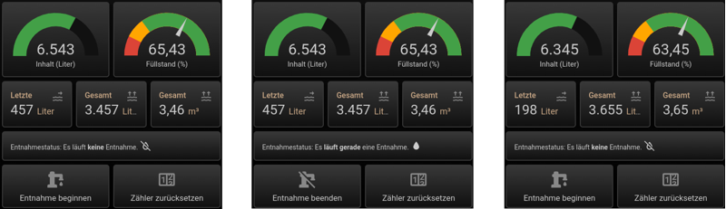

<h1>Home Assistant // BEM - Behälter-Entnahme-Messung</h1>

<b>BEM</b> ist eine einfache Automatisierung für Home Assistant zur Erfassung von Entnahmemengen aus beliebigen Behältern wie beispielsweise Wassertanks. Dabei wird vorausgesetzt, dass der Behälter bereits über einen Sensor verfügt, welcher den aktuellen Füllstand des Behälters misst, und dieser in Home Assistant bereits als entsprechende Sensor-Entität eingerichtet ist.<br />
<b>BEM</b> speichert dann fortwährend bei jeder Entnahme die letzte entnommene sowie die über einen beliebigen Zeitraum hinweg insgesamt entnommene Menge, und stellt beide Werte in Home Assistant zur Verfügung.<br />
Dazu verwendet <b>BEM</b> nur die Standard-Funktionen von Home Assistant und ggf. NodeRED, es werden keine zusätzlichen Integrationen, Add-Ons, HACS-Module oder NodeRED-Paletten (und auch kein Funktions-Node mit JavaScript ;) benötigt. Darüber hinaus sind in dem NodeRED-Flow-Paket auch Einzel-Flows zur Anzeige und zum Zurücksetzen der jeweiligen Werte enthalten.
<hr>
<h2>Vorbereitung</h2>
Zur Ausführung benötigt <b>BEM</b> neben einem beliebigen Füllstandsensor die folgenden Helfer, welche zunächst in Home Assistant angelegt werden müssen.<br /><br />

<ul>
<li> Behälter Entnahme gesamt (<b>input_number.bem_entnahme_gesamt</b>)</li>
<li> Behälter Entnahme letzte (<b>input_number.bem_entnahme_letzte</b>)</li>
<li> Behälter Stand bei Beginn letzter Entnahme (<b>input_number.bem_stand_bei_beginn_letzter_entnahme</b>)</li>
</ul>

<b>Wichtig</b>: Für alle diese Helfer sind folgende Punkte zu beachten:<br />
<ul>
<li>In Home Assistant als Typ <b>Nummer</b> (<i>input_number</i>) anlegen.</li>
<li>Bei <b>1</b> den maximalen Wert gemäß des eigenen Umfeldes eintragen. Dieser Wert sollte höher sein als die Summe aller Entnahmen erreichen kann.</li>
<li>Bei <b>2</b> ist die Schrittgröße entsprechend der gewünschten Genauigkeit einzustellen (in diesem Beispiel 1/1000 = Milliliter).</li>
<li>Bei <b>3</b> die Entitäts-ID exakt so benennen wie zu dem jeweiligen Helfer oben angegeben (der Entitäts-Name hingegen ist egal), oder statt dessen die Entitäts-IDs in den NodeRED-Flows entsprechend ändern (mehr Aufwand).</li>
</ul>
Darüber hinaus ist noch ein Helfer "Behälter Entnahme Status" (<b>input_boolean.bem_entnahme_status</b>) als Typ <b>Schalter</b> (<i>input_boolean</i>) anzulegen - auch hier die korrekte Benennung der Entitäts-ID beachten!<br /><br />


<hr>
<h2>BEM (Varianten)</h2><ul>
<li>Eine Automatisierung von <b>BEM</b> steht aktuell nur als <a href="#nodered_flow">NodeRED-Flow</a> zur Verfügung.</li>
<li>Allerdings kann die Steuerung auch manuell mit der <a href="#dashboard_card">interaktiven Dashboard-Karte</a> erfolgen.</li>
</ul>

<a id="nodered_flow"></a>
<hr>
<h3>NodeRED-Flow</h3>

<b>Download</b> NodeRED-Flow&nbsp;&raquo;&nbsp;<a href="https://github.com/migacode/home-assistant/blob/main/bem/code/bem_nodered_flow_1.10.json"><strong>bem_nodered_flow_1.10.json</strong></a><br />
<br />
Den Quelltext/Flow in NodeRED importieren und wie folgt anpassen.<br />
<br />
In allen Nodes namens "<b>Aktuellen Füllstand einlesen</b>" die Entität <b>sensor.behaelter_fuellstand_aktuell</b> durch die Entität des eigenen tatsächlichen Sensor ersetzen, welcher den Füllstand des realen Behälters enthält.<br />
<b>Achtung:</b> Einen geänderten Node nicht einfach über einen anderen gleichlautenden Node kopieren, da die einzelnen Nodes trotz gleicher Bezeichnung unterschiedliche Ausgänge haben!<br /><br />


<hr>
<h3>Handhabung und Funktionsweise</h3>
Ein Messvorgang besteht <b>immer aus zwei Schritten</b> - einer Messung des Füllstandes zu Beginn und einer Messung zum Ende jeder Entnahme.<br />
Die beiden Schritte werden entsprechend durch die Automatisierungs-Flows 1. (Entnahme Beginn) und 2. (Entnahme Ende) abgebildet.<br />
In <b>Flow 1</b> wird der zum Zeitpunkt dessen Aufrufs gemessene Füllstand des Behälters in dem Helfer <b>bem_stand_bei_beginn_letzter_entnahme</b> gespeichert.
In <b>Flow 2</b> wird der aktuelle Füllstand des Behälters erneut eingelesen und die Differenz zu dem in Flow 1 gemessenen und gespeicherten Stand ermittelt. Die ermittelte Differenz (letzte Entnahmemenge) dann in dem Helfer <b>bem_entnahme_letzte</b> gespeichert, sowie der Gesamtentnahmemenge hinzu addiert. Die neue Gesamtentnahmemenge wird wiederrum in dem Helfer <b>bem_entnahme_gesamt</b> gespeichert. Insofern muss vor Beginn <b>jeder</b> Entnahme der Flow 1, sowie nach dem Ende der Entnahme Flow 2 getriggert werden - beispielsweise parallel zum Ein- bzw. Ausschalten einer Pumpe.<br />
<b>Hinweis:</b> Ein Aufruf von Flow 2 ohne vorherigen Aufruf von Flow 1 führt natürlich dazu, dass Flow 2 den gespeicherten Füllstand noch von vor der/n vorletzten Entnahme/n als Basiswert verwendet, die Messung insofern auch die vorletzte/n Entnahmemenge/n mehrfach beinhaltet und somit auch die Werte der entnommenen Einzel- und Gesamtmenge verfälscht! Daher wird bei Start jedes Flows der Status der Entnahme überprüft und die weitere Verarbeitung entsprechend des Status abgebrochen oder fortgeführt.<br />

<a id="dashboard_card"></a>
<hr>
<h3>Interaktive Dashboard-Karte</h3>
Die nachstehende Dashboard-Karte enthält diverse Funktionen zur Anzeige und Steuerung von <b>BEM</b>:
<ul>
<li>Anzeige des Behälterfüllstandes absolut und prozentual</li>
<li>Anzeige der Einzel- und Gesamt-Entnahmemengen</li>
<li>Anzeige und Überwachung des Entnahmestatus</li>
<li>Buttons zur manuellen Steuerung des Entnahmestatus</li>
<li>Button zum Zurücksetzen des Gesamtentnahmezählers</li>
</ul>
Für die Berechnung der Entnahmemengen spielt es übrigens keine Rolle, ob der Entnahmestatus automatisiert aus den NodeRED-Flows oder manuell über diese Karte gesteuert wird - sogar eine gemischte Verwendung ist möglich.<br /><br />

<b>Download</b> Dashboard-Karte&nbsp;&raquo;&nbsp;<a href="https://github.com/migacode/home-assistant/blob/main/bem/code/bem_dashboard_card_1.10.yaml"><strong>bem_dashboard_card_1.10.yaml</strong></a><br />
<br />
Den Quelltext als neue Karte (manuell über YAML-Code einfügen) im Dashboard anlegen.<br />
<br />
<b>Erforderliche Erweiterung 1 für interaktive Dashboard-Karte:</b><br />
Zur besseren Darstellung der Messwerte (Rundung etc.) verwendet die Karte zusätzliche Sensoren. Um diese anzulegen sind die folgenden Zeilen in der <b>configuration.yaml</b> unter dem Bereich <b>template:</b> hinzuzufügen.<br />
<b>Achtung:</b> Die Entitäts-ID <b>sensor.behaelter_fuellstand_aktuell</b> muss wie zuvor natürlich auch wieder durch die Entitäts-ID des eigenen tatsächlichen Sensors ersetzt werden, sowie die Kapazität in der Formel (der Wert <i>10000</i>) an die Größe (Fassungsvermögen) des eigenen Behälters angepasst werden.<br />

```yaml
# =============================================================================
# Behälter-Entnahme-Messung (BEM) - Templates
# Version: 1.10
# =============================================================================
# -----------------------------------------------------------------------------
# Umwandlung von in Helfern gespeicherten Werten zur Verwendung im Dashboard
# -----------------------------------------------------------------------------
  - sensor:
    - name: "Behälter Entnahme letzte (gerundet)"
      state: "{{ states('input_number.bem_entnahme_letzte') | round(0) }}"
  - sensor:
    - name: "Behälter Entnahme gesamt (gerundet)"
      state: "{{ states('input_number.bem_entnahme_gesamt') | round(0) }}"
  - sensor:
    - name: "Behälter Entnahme gesamt (m3)"
      state: "{{ (states('input_number.bem_entnahme_gesamt') | float / 1000) | round(2) }}"
# -----------------------------------------------------------------------------
# Umwandlung von echtem gemessenen Füllstand zur Verwendung im Dashboard
# -----------------------------------------------------------------------------
  - sensor:
    - name: "Behälter Füllstand aktuell (gerundet)"
      state: "{{ states('sensor.behaelter_fuellstand_aktuell') | float | round(0) }}"
  - sensor:
    - name: "Behälter Füllstand aktuell (prozent)"
      state: "{{ ((states('sensor.behaelter_fuellstand_aktuell') | float) / 10000 * 100) | round(2) }}"
```

<br />
<b>Erforderliche Erweiterung 2 für interaktive Dashboard-Karte:</b><br />
Da die "action"-Bereiche von Dashboard-Karten leider (noch?) keine Templates unterstützen, müssen wir uns diesbezüglich mit zusätzlichen Skripten behelfen. Dazu sind die folgenden Zeilen in der <b>configuration.yaml</b> unter dem Bereich <b>script:</b> hinzuzufügen.<br />
<b>Nochmal Achtung:</b> Die Entitäts-ID <b>sensor.behaelter_fuellstand_aktuell</b> muss wie zuvor natürlich auch wieder durch die Entitäts-ID des eigenen tatsächlichen Sensors ersetzt werden.<br />

```yaml
# =============================================================================
# Behälter-Entnahme-Messung (BEM) - Scripts
# Version: 1.10
# =============================================================================
# -----------------------------------------------------------------------------
# Entnahme Beginn
# -----------------------------------------------------------------------------
  bem_entnahme_beginn:
    alias: BEM - Entnahme Beginn
    description: ""
    sequence:
      - service: input_number.set_value
        continue_on_error: true
        target:
          entity_id: input_number.bem_stand_bei_beginn_letzter_entnahme
        data:
          value: "{{ states('sensor.behaelter_fuellstand_aktuell') | float }}"
      - service: input_boolean.turn_on
        continue_on_error: true
        target:
          entity_id: input_boolean.bem_entnahme_status
# -----------------------------------------------------------------------------
# Entnahme Ende
# -----------------------------------------------------------------------------
  bem_entnahme_ende:
    alias: BEM - Entnahme Ende
    variables:
      letzte_gesamt: "{{ states('input_number.bem_entnahme_gesamt') | float }}"
      stand_beginn: "{{ states('input_number.bem_stand_bei_beginn_letzter_entnahme') | float }}"
      stand_ende: "{{ states('sensor.behaelter_fuellstand_aktuell') | float }}"
    description: ""
    sequence:
      - service: input_boolean.turn_off
        continue_on_error: true
        target:
          entity_id: input_boolean.bem_entnahme_status
      - service: input_number.set_value
        continue_on_error: true
        target:
          entity_id: input_number.bem_entnahme_letzte
        data:
          value: "{{ (stand_beginn - stand_ende) | float }}"
      - service: input_number.set_value
        continue_on_error: true
        target:
          entity_id: input_number.bem_entnahme_gesamt
        data:
          value: "{{ (letzte_gesamt + stand_beginn - stand_ende) | float }}"
```

<br />
