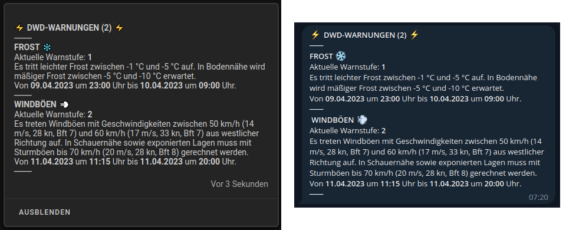
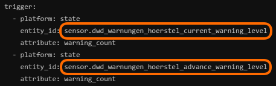
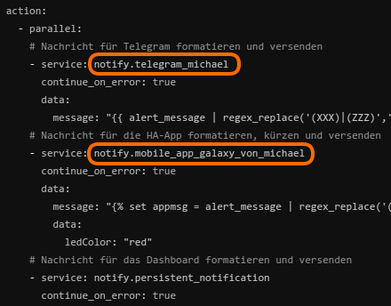
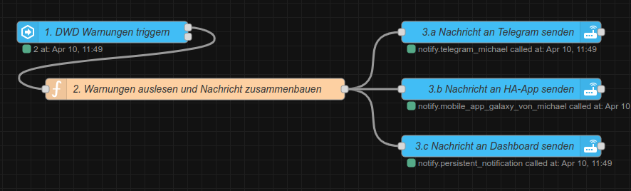
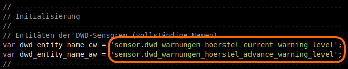
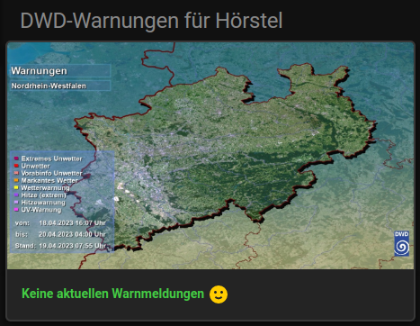
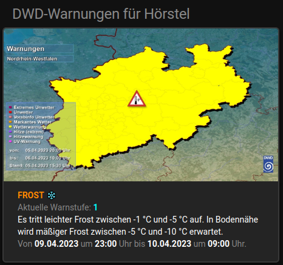
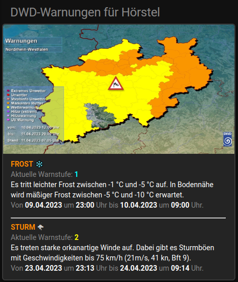
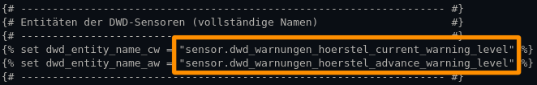

<h1>Home Assistant // DWD-Warnungen</h1>

Die Integration des Warndienstes des <a href="https://www.dwd.de/">Deutschen Wetterdienst</a> (DWD) erfolgt manuell in der <b>configuration.yaml</b> durch Anlage eines Sensors (hier als Beispiel für die Stadt Hörstel).<br/>
```yaml
sensor:
  - platform: dwd_weather_warnings
    name: DWD-Warnungen Hoerstel
    region_name: 805566016
```
Der <i>name</i> ist frei wählbar, Home Assistant setzt daraus allerdings die Namen der zugehörigen Entitäten zusammen ;)<br />
<br />
<b>Hinweis</b>: In neueren Versionen von Home Assistant wird die Integration <u>nicht</u> manuell angelegt, man braucht dazu nur die <a href="https://www.home-assistant.io/integrations/dwd_weather_warnings/">Integration des Deutschen Wetterdienstes</a> hinzufügen. Die entsprechenden Entitäts-Namen (IDs) muss man dann in dieser nachsehen.<br />
<br />
<b>Tipp:</b> Als <i>region_name</i> nicht den Namen des Ortes, sondern die entsprechende <i>Warncell-ID</i> eintragen, welche in folgender Liste zu finden ist.<br />
Warncell-IDs: https://www.dwd.de/DE/leistungen/opendata/help/warnungen/cap_warncellids_csv.html<br />
<b>Hinweis:</b> Neue Sensoren werden in Home Assistant leider erst nach einem Neustart aktiv.

<hr>
<h2>Erweiterungen für die DWD-Integration (Deutscher Wetterdienst) von Home Assistant</h2><ul>
<li><a href="#automation">Native Automatisierung zum Versenden von DWD-Warnungen an Telegram<sup>1</sup>, HA-App<sup>2</sup> und Dashboard</a></li>
<li><a href="#nodered">NodeRED-Flow zum Versenden von DWD-Warnungen an Telegram<sup>1</sup>, HA-App<sup>2</sup> und Dashboard</a></li>
<li><a href="#dashboard">Dashboard-(Lovelace-)Karte zur Anzeige von DWD-Warnungen in Home Assistant</a></li>
</ul>
(1) Für den Versand von Benachrichtigungen an Telegram muss die entsprechende <a href="https://www.home-assistant.io/integrations/telegram">Telegram-Integration</a> natürlich zuvor eingerichtet sein.<br />
(2) Ebenso erfolgt der Versand an die HA-App natürlich auch nur, wenn diese auf dem/n Endgerät/en installiert und eingerichtet ist.<br />

<a id="automation"></a>
<hr>
<h3>Automatisierung zum Versenden von DWD-Warnungen an Telegram, HA-App und Dashboard (native)</h3>

Quelltext&nbsp;&raquo;&nbsp;<a href="https://github.com/migacode/home-assistant/blob/main/dwd/code/DWD_warnings_automation.yaml">DWD_warnings_automation.yaml</a><br />
<br />
Den Quelltext wie folgt anpassen und in die <b>automations.yaml</b> kopieren.<br />
<br />
1. An den markierten Stellen die Entitäts-Namen der Sensoren jeweils durch die eigenen ersetzen.<br />
(Wer den Sensor wie oben angeben für Hörstel angelegt hat, kann diesen Schritt überspringen ;)<br />
<br />


2. An den markierten Stellen die Entitäts-Namen der Benachrichtigungs-Dienste jeweils durch die eigenen ersetzen.<br />
<br />

Selbstverständlich muss man auch nicht alle Kanäle nutzen - wer keine Benachrichtigung an Telegram, die HA-App oder das Dashboard wünscht, kann in dem Bereich <i>action:</i> die Zeilen für den jeweiligen Service einfach löschen.<br />
<br />
3. Nicht vergessen bei den Entwicklerwerkzeugen die Konfiguration zu prüfen und Automatisierungen neu zu laden :)<br />
<br />

<a id="nodered"></a>
<hr>
<h3>NodeRED-Flow zum Versenden von DWD-Warnungen an Telegram, HA-App und Dashboard</h3>

NodeRED-Flow&nbsp;&raquo;&nbsp;<a href="https://github.com/migacode/home-assistant/blob/main/dwd/code/DWD_warnings_nodered_flow.json">DWD_warnings_nodered_flow.json</a><br />
<br />
Den Quelltext/Flow in NodeRED importieren und wie folgt anpassen.<br />
(Wer den Sensor wie oben angeben für Hörstel angelegt hat, kann Schritt 1. und 2. direkt überspringen ;)<br />
<br />
1. In Node 1 (DWD-Warnungen triggern) an den markierten Stellen die Entitäts-Namen der Sensoren jeweils durch die eigenen ersetzen.<br />
<br />

2. In Node 2 (Warnungen auslesen und Nachricht zusammenbauen) an den markierten Stellen die Entitäts-Namen der Sensoren jeweils durch die eigenen ersetzen.<br />
<br />

3. In den Nodes 3.a und 3.b jeweils den Service-Namen für die Benachrichtigung durch den eigenen ersetzen.<br />
Selbstverständlich muss man auch nicht alle Kanäle nutzen - wer keine Benachrichtigung an Telegram, die HA-App oder das Dashboard wünscht, kann den entsprechenden Node (3.a, 3.b, 3.c) einfach löschen.<br />
<br />

<a id="dashboard"></a>
<hr>
<h3>Dashboard-(Lovelace-)Karte zur Anzeige von DWD-Warnungen in Home Assistant</h3>

Quelltext&nbsp;&raquo;&nbsp;<a href="https://github.com/migacode/home-assistant/blob/main/dwd/code/DWD_warnings_dashboard_card.yaml"><strong>DWD_warnings_dashboard_card.yaml</strong></a><br />
<br />
Den Quelltext wie folgt anpassen und als neue Karte (manuell über YAML-Code einfügen) im Dashboard anlegen.<br />
<br />
1. An der markierten Stelle die Entitäts-Namen der Sensoren durch die eigenen ersetzen.<br />
(Wer den Sensor wie oben angeben für Hörstel angelegt hat, kann diesen Schritt überspringen ;)<br />
<br />

2. Wer einen anderen Ort als Hörstel verwendet oder andere Karten angezeigt bekommen möchte, kann die Überschrift mit der Angabe <i>title:</i> sowie die Pfadangaben hinter <i>image:</i> und <i>url_path:</i> für das angezeigte Bild an den entsprechenden Ort anpassen.<br/>
Die dazu benötigten Angaben findet man auf den Webseiten des DWD unter <a href="https://www.dwd.de/DE/wetter/warnungen_aktuell/objekt_einbindung/objekteinbindung_node.html">Objekt-Einbindung</a> und <a href="https://www.dwd.de/DE/wetter/warnungen_gemeinden/warnkarten/warnkarten_node.html">Warnkarten</a>.<br />
<br />
3. Die Schriftfarben sind für die Darstellung auf dunklem Hintergrund konfiguriert. Wer die Karte auf einem hellen Hintergrund nutzen möchte (oder andere Farben bevorzugt), kann die Farben ggf. sehr einfach durch andere RGB-Werte in den entsprechend selbsterklärenden color-Variablen anpassen.<br />
Darüber hinaus verwendet die Karte das HACS-Modul "card-mod", jedoch nur zur Gestaltung der Karten-Umrandung. Wer card-mod nicht verwendet, oder wem die Karte unformatiert besser gefällt, der kann die entsprechenden Style-Angaben problemlos entfernen.<br />
<br />
<hr>
