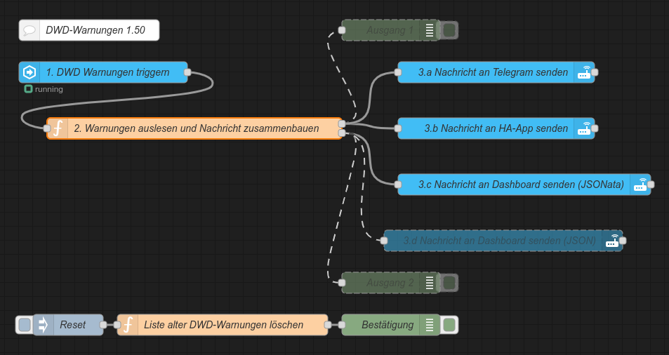

# Home Assistant - DWD Warnungen

Die Integration des Warndienstes des <a href="https://www.dwd.de/">Deutschen Wetterdienst</a> (DWD) erfolgt manuell in der <b>configuration.yaml</b> durch Anlage eines Sensors (hier als Beispiel für Hörstel).<br/>
```yaml
sensor:
  - platform: dwd_weather_warnings
    name: DWD-Warnungen Hoerstel
    region_name: 805566016
```
Der <i>name</i> ist frei wählbar, Home Assistant setzt daraus allerdings die Namen der zugehörigen Entitäten zusammen ;)<br />
<b>Tipp:</b> Als <i>region_name</i> nicht den Namen des Ortes, sondern die entsprechende <i>Warncell-ID</i> eintragen, welche in folgender Liste zu finden ist.<br />
Warncell-IDs: https://www.dwd.de/DE/leistungen/opendata/help/warnungen/cap_warncellids_csv.html

<hr>
<strong>Erweiterungen für die DWD-Integration (Deutscher Wetterdienst) von Home Assistant</strong><br />
<br />
<ul>
<li><a href="#automation">Native Automation zum Versenden von DWD-Warnungen an Telegram<sup>1</sup>, HA-App<sup>2</sup> und Dashboard</a></li>
<li><a href="#nodered">NodeRed-Flow zum Versenden von DWD-Warnungen an Telegram<sup>1</sup>, HA-App<sup>2</sup> und Dashboard</a></li>
<li><a href="#dashboard">Dashboard-Karte zur Anzeige von DWD-Warnungen in Home Assistant</a></li>
</ul>
(1) Für den Versand von Benachrichtigungen an Telegram muss die entsprechende <a href="https://www.home-assistant.io/integrations/telegram">Telegram-Integration</a> natürlich zuvor eingerichtet sein.<br />
(2) Ebenso erfolgt der Versand an die HA-App natürlich auch nur, wenn diese auf dem/n Endgerät/en installiert und eingerichtet ist.<br />

<a id="automation"></a>
<hr>
<strong>Automation zum Versenden von DWD-Warnungen an Telegram, HA-App und Dashboard (native)</strong><br />
<br />

Quelltext: <a href="https://github.com/migacode/home-assistant/blob/main/dwd/DWD_warnings_automation.yaml">DWD_warnings_automation.yaml</a><br />
<br />
Den Quelltext wie folgt anpassen und in die <b>automations.yaml</b> kopieren.<br />
1. An den markierten Stellen die Entitäts-Namen jeweils durch die eigenen ersetzen.<br />
<br />

Selbstverständlich muss man auch nicht alle Kanäle nutzen - wer keine Benachrichtigung an Telegram, die HA-App oder das Dashboard wünscht, kann in dem Bereich <i>action:</i> die Zeilen für den jeweiligen Service einfach löschen.<br />
<br />
2. Nicht vergessen bei den Entwicklerwerkzeugen die Konfiguration zu püfen und Automatisierungen neu zu laden ;)<br />
<br />

<a id="nodered"></a>
<hr>
<strong>NodeRed-Flow zum Versenden von DWD-Warnungen an Telegram, HA-App und Dashboard</strong><br />
<br />
... noch in Arbeit ... kommt bald ... :)
<!--

NodeRED-Flow: <a href="https://github.com/migacode/home-assistant/blob/main/dwd/DWD_warnings_nodered_flow.json">DWD_warnings_nodered_flow.json</a><br />
<br />
Die Datei in NodeRED importieren und wie folgt anpassen.<br />
1. Im Node 1 (DWD-Warnungen triggern) an den markierten Stellen die Entitäts-Namen geweils durch die eigenen ersetzen.<br />
Dabei beachten, als <i>msg.topic</i> den Entitäts-Namen generisch ohne Nummern, aber mit Unterstrich am Ende zu schreiben ;)<br />
<br />

2. Danach noch in den Nodes 7.a und 7.b jeweils den Service-Namen durch den eigenen ersetzen.<br />
Selbstverständlich muss man auch nicht alle Kanäle nutzen - wer keine Benachrichtigung an Telegram, die HA-App oder das Dashboard wünscht, kann den entsprechenden Node (7.a, 7.b, 7.c) einfach löschen.<br />
<br />
-->

<a id="dashboard"></a>
<hr>
<strong>Dashboard-Karte zur Anzeige von DWD-Warnungen in Home Assistant</strong><br />
<br />


Quelltext: <a href="https://github.com/migacode/home-assistant/blob/main/dwd/DWD_warnings_dashboard_card.yaml"><strong>DWD_warnings_dashboard_card.yaml</strong></a><br />
<br />
Den Quelltext wie folgt anpassen und als neue Karte (manuell über YAML-Code einfügen) im Dashboard anlegen.<br />
1. An der markierten Stelle die Entitäts-Namen durch die eigenen ersetzen.<br />
<b>HINWEIS:</b> Die Schriftfarben sind für die Darstellung auf dunklem Hintergrund konfiguriert. Wer die Karte auf einem hellen Hintergrund nutzen möchte (oder andere Farben bevorzugt), kann die Farben ggf. sehr einfach durch andere RGB-Werte in den entsprechend selbsterklärenden color-Variablen anpassen :)<br />
<br />

Ach ja - wer einen anderen Ort als Hörstel verwendet, möchte vermutlich auch die Überschrift <i>title:</i> sowie die Pfadangaben <i>image:</i> und <i>url_path:<i> für das angezeigte Bild an den entsprechenden Ort anpassen :)<br/>
Die dazu benötigten Angaben findet man auf den Webseiten des DWD unter <a href="https://www.dwd.de/DE/wetter/warnungen_aktuell/objekt_einbindung/objekteinbindung_node.html">Objekt-Einbindung</a> und <a href="https://www.dwd.de/DE/wetter/warnungen_gemeinden/warnkarten/warnkarten_node.html">Warnkarten</a>.
<br />
<hr>
