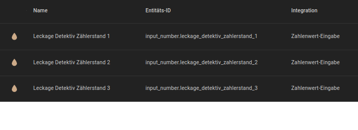

<h1>Home Assistant // LeckDet - Leckage Detektiv</h1>

<b>LeckDet</b> ist eine einfache Automatisierung für Home Assistant zur Erkennung von unerwünschten Verbräuchen in beliebigen Leitungssystemen, wie beispielsweise Rohrbrüche von Wasserleitungen im Haus. Für die Verwendung von <b>LeckDet</b> wird vorausgesetzt, dass das Leitungssystem bereits über einen Verbrauchs-Zähler verfügt, welcher den bisherigen Gesamt-Verbrauch und/oder laufende Verbräuche anzeigt, und diese/r in Home Assistant bereits als entsprechende Sensor-Entität/en eingerichtet ist/sind.  
<b>Funktionsweise</b> 
Innerhalb eines Zeitraums, in welchem kein beabsichtigter Verbrauch zu erwarten ist (typischerweise nachts), wird in bestimmten Abständen der jeweils aktuelle Zählerstand eingelesen und intern gespeichert.
Nach der letzten Messung werden alle gemessenen Zählerstände miteinander verglichen. Wenn sich alle eingelesenen Zählerstände mindestens um einen frei konfigurierbaren Wert voneinander unterscheiden, liegt vermutlich eine Leckage vor.
Durch die Verwendung mehrfacher Zählerstanderfassungen können innerhalb des überwachten Zeitraums sogar (natürlich nicht zu viele) normale Entnahmen erfolgen, ohne dass dadurch die Erkennung eines permanenten unerwünschten Verbrauchs beeinträchtigt wird. 
Darüber hinaus verwendet <b>LeckDet</b> nur die Standard-Funktionen von Home Assistant und ggf. NodeRED, es werden keine zusätzlichen Integrationen, Add-Ons, HACS-Module oder NodeRED-Paletten benötigt.

<h2>Vorbereitung</h2>
Zur Ausführung benötigt <b>LeckDet</b> neben einem beliebigen bereits eingerichteten Verbrauchs-Sensor die folgenden Helfer, welche zunächst in Home Assistant angelegt werden müssen.  
<b>1.</b> Als Erstes die Helfer "<b>Leckage Detektiv Zählerstand 1</b>", "<b>Leckage Detektiv Zählerstand 2</b>" und "<b>Leckage Detektiv Zählerstand 3</b>" (input_number.leckage_detektiv_zahlerstand_1, input_number.leckage_detektiv_zahlerstand_2 und input_number.leckage_detektiv_zahlerstand_3) jeweils als Typ <b>Zahlenwert-Eingabe</b> anlegen.
Dabei beachten, im <b>Namen</b> die fortlaufende Nummer zu ändern <b>(s.u. 1)</b>. <b>Achtung:</b> Die Entitäten der Helfer werden bei der Anlage des Helfers automatisch aus dessen eingegebenen Namen erzeugt - dabei werden alle Umlaute umgewandelt, so dass in den Namen der entsprechenden Entitäten ~z<i>a</i>hlerstand~ statt ~z<i>ä</i>hlerstand~ enthalten ist. 
 
Als nächstes muss der <b>Maximalwert</b> so hoch gesetzt werden, dass dieser durch einen Wert des Sensors zur Verbrauchsmessung nie erreicht werden kann <b>(s.u. 2)</b>. 
 
Ebenfalls ist es sehr wichtig, die <b>Schrittweite</b> mit hinreichend vielen Stellen hinter dem Komma anzugeben - beispielsweise entsprechen vier Stellen [0,0001] der aktuellen Standard-Auflösung der in Deutschland verbauten Wasserzähler <b>(s.u. 3)</b>. 
 
 
 
<b>2.</b> Den Helfer "<b>Leckage Detektiv - Leck erkannt</b>" (input_boolean.leckage_detektiv_leck_erkannt) als Typ <b>Schalter</b> anlegen, welcher den aktuellen Status der Erkennung wiedergibt, so dass darüber weitere individuelle Aktionen getriggert werden können.  
 
 
Die fertigen Entitäten sollten danach in der Liste der Helfer so zu finden sein: 
 

<h2>LeckDat (Varianten)</h2><ul>
<li><b>LeckDet</b> steht aktuell nur als <a href="#nodered_flow">NodeRED-Flow</a> zur Verfügung.</li>
</ul>

<h3>NodeRED-Flow</h3>
 
<b>Download</b> NodeRED-Flow&nbsp;&raquo;&nbsp;<a href="https://github.com/migacode/home-assistant/blob/main/leckdet/code/leckdet_nodered_flow_1.00.json"><strong>leckdet_nodered_flow_1.00.json</strong></a> 
 
Den Quelltext/Flow in NodeRED importieren und wie folgt anpassen. 
 
<b>1.</b> In allen Nodes "<i>Aktuellen Zählerstand einlesen</i>" (fünf Vorkommen) muss die Entitäts-ID des Sensors gegen die des eigenen ersetzt werden. 
 
 
 
<b>2.</b> In den vier Inject-Nodes "<i>Erste Messung um ...</i>" bis "<i>Vierte Messung um ...</i>" sind bei Bedarf die Uhrzeiten auf die individuellen Gegebenheiten vor Ort anzupassen. Achtung: Nicht nur im Namen des Node, sondern insbesondere in dem relevanten unteren Teil der Maske ;). 
 
 
 
<b>3.</b> Die eigentliche Logik der Leckage-Erkennung ist in dem Funktions-Node "<i>Auf Leckage prüfen</i>" untergebracht. Für eine individuelle Erweiterung oder Konfiguration der Logik kann dieser Node bei Bedarf natürlich ebenfalls einfach angepasst werden. 
 

Fertig. 
 
