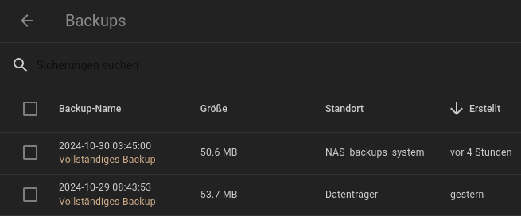
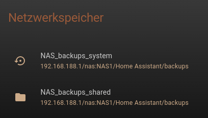
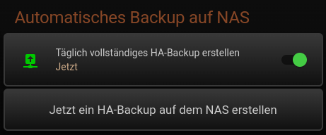

<h1>Home Assistant // NAS-Backup</h1>
<h2>Automatische HA-Backups auf ein NAS</h2>
Da die Vorhaltung der System-Backups von Home Assistant auf dem selben Datenträger wie das HA-OS selbst im Extremfall (Medium defekt o.ä.) ziemlich sinnlos ist, kann man wie nachstehend beschrieben automatisiert vollständige Sicherungen von Home Assistant auf einem NAS erstellen, sowie ebenfalls automatisiert alle dort befindlichen Backups löschen, welche älter als x Tage sind.<br/>
Im Gegensatz zu diversen Lösungen anderer Anbieter ist diese hier ausschließlich mit HA-Bordmitteln realisiert - ohne jegliche Add-ons, HACS oder sonstigen Code von unbekannten Dritten.<br/>
<hr/>
<h2>1. Einrichtung des NAS - exemplarisch in der FRITZ!Box / FRITZ!NAS</h2>
Als NAS wird in diesem Fall beispielhaft ein FRITZ!NAS verwendet - es kann jedoch jedes beliebige andere NAS verwendet werden, welches per SMB Verzeichnisse im Netzwerk zur Verfügung stellt.<br/>
Zur Einbindung des NAS in Home Assistant müssen von diesem bekannt sein:<br/><ul>
<li>Adresse des NAS</li>
<li>Bezeichnung des freigegebenen Verzeichnisses</li>
<li>Name des NAS-Benutzers</li>
<li>Passwort des NAS-Benutzers</li>
</ul>
<b>1.1 USB-Speichermedium einrichten</b><br/>
Ein geeignetes USB-Speichermedium mit ausreichend großer Kapazität für mindestens 10 Backups als USB-Speicher mit Namen <b>NAS1</b> einrichten. Der Name <b>NAS1</b> kann beliebig gewählt werden, muss dann aber natürlich in der folgenden Einrichtung an allen vorkommenden Stellen entsprechend angepasst werden.<br/>
Die Größe einer vollständigen Sicherung kann man in HA unter <i>Einstellungen -&gt; System -&gt; Backups</i> sehen, wenn eine solche erstellt ist. Typischerweise wächst die Größe von Vollsicherungen jedoch im Laufe der Zeit kontinuierlich an, sowie natürlich mit jeder Erweiterung des Systems - das sollte man bei der Dimensionierung des auf dem NAS zur Verfügung stehenden Speicherplatzes selbstverständlich berücksichtigen.<br />
Hier ein&nbsp;»&nbsp;<a href="img/HA_Backup_FB_NAS1.png" target="_blank">Beispiel für USB-Speicher in der FRITZ!Box</a> <br/>
<br/>
<b>1.2
Ordnerstruktur mit eigenem Ordner für Backups anlegen</b><br/>
In der FRITZ!Box in das FRITZ!NAS wechseln und dort bei<br />
<i>NAS1 -&gt; Neuer Ordner</i> den Ordner <b>Home Assistant</b> sowie zudem darunter den Ordner <b>backups</b> anlegen.<br/>
Hier ein&nbsp;»&nbsp;<a href="img/HA_Backup_FB_Ordner.png" target="_blank">Beispiel für die Ordnerstruktur im FRITZ!NAS</a><br/>
<br/>
<b>1.3 Benutzer mit dediziertem Zugriff auf diesen Ordner einrichten</b><br/>
Auf dem NAS einen Benutzer <b>ha_backup</b> nur für den Zugang zu NAS-Inhalten auf das Verzeichnis <i>NAS1/Home Assistant/backups</i> (lesen und schreiben) einrichten.<br/>
Hier ein&nbsp;»&nbsp;<a href="img/HA_Backup_FB_Benutzer.png" target="_blank">Beispiel für die Einrichtung eines Benutzers des FRITZ!NAS</a><br />
<br />
<hr/>
<h2>2. Automatisierung von vollständigen HA-Backups auf das NAS</h2>
Nachdem das NAS wie oben stehend für die Speicherung von HA-Backups konfiguriert ist, kann die Speicherung von HA-Backups darauf sowie die automatische Erstellung dieser Backups in Home Assistant eingerichtet werden. Dazu sind folgende Schritte erforderlich.<br />
<h3>2.1 Netzwerkspeicher zur Verwendung für HA-System-Backups anlegen</h3>
Diese kann man in HA unter <i>Einstellungen -&gt; System -&gt; Speicher -&gt; Netzwerkspeicher hinzufügen</i> konfigurieren.<br/>
In der Maske die folgenden Eintragungen machen (ggf. natürlich angepasst an die eigene Umgebung) und den Netzwerkspeicher mit dem Button "Verbinden" anlegen.<br/>
<ul>
<li>Name: NAS_backups_system</li>
<li>Verwendung: Backup</li>
<li>Server: 192.168.188.1/nas (Adresse des NAS)</li>
<li>Protokoll: Samba/Windows (SMB/CIFS)</li>
<li>Server-Freigabe: NAS1/Home Assistant/backups (wie auf dem NAS angelegt)</li>
<li>Benutzername: ha_backup (bzw. Name des NAS-Benutzers wie auf dem NAS angelegt)</li>
<li>Passwort: Kennwort des NAS-Benutzers (wie auf dem NAS angelegt)</li>
</ul>
Bild zu&nbsp;»&nbsp;<a href="img/HA_NAS_backups_system.png" target="_blank">Hinzufügen eines Backup-Netzwerkspeichers in HA</a><br />
<h3>2.2 Standard-Backup-Speicherort von HA auf NAS ändern</h3>
Um diesen Netzwerkspeicher grundsätzlich für alle System-Backups zu verwenden, ist dies in den Einstellungen von HA wie folgt zu konfigurieren:<br/>
<i>Einstellungen -&gt; System -&gt; Backups -&gt; 3-Punkte-Menü -&gt; Standard-Backup-Speicherort ändern -&gt; <b>NAS_backups_system</b></i> auswählen.<br/>
Alle Backup-Dateien werden dann ab sofort physikalisch auf dem NAS gespeichert.<br/>
<b>Achtung:</b> Der auf diese Art konfigurierte Netzwerkspeicher <b>NAS_backups_system</b> ist im Dateisystem von HA für Benutzer nicht sichtbar und kann nur vom Supervisor als Speicherort für System-Backups verwendet werden.<br/>
Alternativ dazu kann man den Standard-Backup-Speicherort jedoch auch für HA-interne Backups (bspw. vor Updates) auf dem lokalen Datenträger belassen, und den Netzwerkspeicher <b>NAS_backups_system</b> nur individuell bspw. bei automatisierten Backups verwenden.
<h3>2.3 Automatisierung einrichten</h3>
Die nachstehende Automatisierung in die <i>automations.yaml</i> eintragen. In diesem Beispiel wird jeden Tag morgens um 03:45 Uhr ein Backup erstellt. Die Wochentage als <i>Condition</i> sind optional, damit man Backups auch nur an bestimmten Tagen (beispielsweise wöchentlich) konfigurieren kann. Die Zeiten können selbstverständlich gemäß den eigenen Anforderungen angepasst werden.<br/>
HA-Kenner merken übrigens sicher schnell, dass die YAML-Notation dieser Automatisierung bereits die "Neue" ist, welche seit Version 2024.10 verwendet wird - daher ist die Mindestvoraussetzung für den Ablauf dieser Automatisierung natürlich auch die entsprechend installierte Version des HA-Core. ;)<br/>

```yaml

- id: "backup_system_to_nas"
  alias: Vollständiges HA-Backup auf NAS
  description: ""
  triggers:
    - trigger: time
      at: "03:45:00"
  conditions:
    - condition: time
      weekday:
        - mon
        - tue
        - wed
        - thu
        - fri
        - sat
        - sun
  actions:
    - action: hassio.backup_full
      data:
        compressed: true
        homeassistant_exclude_database: false
        location: NAS_backups_system
        # password: my_password
  mode: single

```

Wenn die Sicherung mit einem Passwort versehen werden soll, muss der entsprechende Parameter auskommentiert und gesetzt werden.<br />
<br />
<b>Wichtig:</b> Nach Anlage der Automatisierung nicht vergessen, die Konfiguration von Home Assistant zu aktualisieren (YAML-Konfiguration neu laden oder HA neu starten).<br />
In der Liste der Backups erscheinen die automatisierten Backups fortan mit dem Standort "NAS_backups_system" - lokale Backups liegen weiterhin auf "Datenträger" (siehe Bild).<br />
<br />
<br />
<br />

<hr/>
<h2>3. Automatisierung zum Löschen alter HA-Backups auf dem NAS</h2>
Aufgrund der Größe der jeweiligen Backup-Dateien kommen im Laufe der Zeit natürlich enorme Datenmengen zustande, so dass man vermutlich den Zeitraum der zur Verfügung stehenden Sicherungen eingrenzen und ältere Backup-Dateien löschen möchte. Natürlich kann man das von Zeit zu Zeit manuell machen, schöner wäre aber, wenn sich auch dies automatisieren ließe. Leider bietet HA selbst keinen Dienst an, mit welchem sich Backups automatisiert löschen lassen. Daher muss dies mit einem eigenen Script erledigt werden. Wie jedoch schon zuvor gesagt, ist das Verzeichnis mit den Backup-Dateien im Userspace von HA nicht zugänglich. Um als Benutzer innerhalb von HA trotzdem direkten Zugriff auf die Backup-Dateien auf dem NAS zu erhalten, muss also zunächst ein weiterer Netzwerkspeicher, diesmal allerdings vom Typ <i>Freigabe</i>, angelegt werden, welcher die selbe Server-Freigabe hat, wie die des zuvor eingerichteten <i>Backup-Netzwerkspeichers</i>.

<h3>3.1 Netzwerkspeicher mit Freigabe zum Zugriff durch Benutzer anlegen</h3>
Weiteren Netzwerkspeicher in HA unter <i>Einstellungen -&gt; System -&gt; Speicher -&gt; Netzwerkspeicher hinzufügen</i> wie folgt einrichten.<br />
In der Maske die folgenden Eintragungen machen (ggf. natürlich angepasst an die eigene Umgebung) und den Netzwerkspeicher mit dem Button "Verbinden" anlegen.<br/>
<ul>
<li>Name: NAS_backups_shared</li>
<li>Verwendung: Freigabe</li>
<li>Server: 192.168.188.1/nas (Adresse des NAS)</li>
<li>Protokoll: Samba/Windows (SMB/CIFS)</li>
<li>Server-Freigabe: NAS1/Home Assistant/backups (wie auf dem NAS angelegt)</li>
<li>Benutzername: ha_backup (bzw. Name des NAS-Benutzers wie auf dem NAS angelegt)</li>
<li>Passwort: Kennwort des NAS-Benutzers (wie auf dem NAS angelegt)</li>
</ul>
Bild zu&nbsp;»&nbsp;<a href="img/HA_NAS_backups_shared.png" target="_blank">Hinzufügen eines Freigabe-Netzwerkspeichers in HA</a><br />
<br/>
Dadurch wird im für Benutzer zugänglichen Teil des HA-Dateisystems ein Ordner /share/NAS_backups_shared angelegt, welcher auf den selben NAS-Ordner verlinkt ist, in dem auch die Backup-Dateien liegen.<br/>
<br/>
Wenn alles richtig gemacht wurde, sind beide Netzwerkspeicher in der Übersicht zu sehen.<br/>


<h3>3.2 Script einrichten</h3>
Um das automatisierte Löschen veralteter Backup-Dateien auf dem NAS zu bewerkstelligen, muss zunächst das folgende Script angelegt werden, welches diese Dateien findet und löscht. Lokale Backups werden durch dieses Script übrigens nicht gelöscht.<br/>
<h4>3.2.1 Script-Datei anlegen</h4>
Das folgende Script ist als Datei an einem beliebigen Ort zu hinterlegen. In diesem Fall heißt die Datei <b>delete_old_backups_from_nas</b> und liegt in dem Ordner <b>/config/tools</b>. Wenn das Script an einem anderen Ort hinterlegt wird, muss lediglich die Pfadangabe in dem weiter unten stehenden <i>Shell Command</i> entspechend angepasst werden.<br />
Bei Bedarf ist zudem auch die Konfiguration innerhalb dieser Datei an die eigenen Anforderungen anzupassen.<br />
<b>Download</b>&nbsp;&raquo;&nbsp;<a href="https://github.com/migacode/home-assistant/blob/main/nasback/code/delete_old_backups_from_nas"><strong>delete_old_backups_from_nas</strong></a><br />
----------------------------------------<br />
<b>Exkurs: Datei neu anlegen</b><br />
Am einfachsten wird die vorstehende Datei mit einem Tool der Wahl in das HA-Dateisystem kopiert. Sollte das gerade nicht möglich sein, oder der manuelle Weg bevorzugt werden, kann die Erstellung der Datei in HA auch schnell und einfach a) mit dem Add-on <i>File editor</i> oder b) über die Kommandozeile der Konsole bzw. in einem Terminal von HA mittels des eingebauten Text-Editors <i>nano</i> erfolgen.<br />
In letzterem Fall wie folgt vorgehen:<br />
$ cd /config<br />
$ mkdir tools <i>(nur falls noch nicht vorhanden)</i><br />
$ cd tools<br />
$ nano delete_old_backups_from_nas<br />
-&gt; Text eingeben<br />
-&gt; Mit Ctrl-S Datei speichern<br />
-&gt; Mit Ctrl-X Editor verlassen<br />
----------------------------------------<br />
<b>Wichtig:</b> Egal auf welche Art die Script-Datei angelegt worden ist - damit diese ausführbar wird, müssen deren Zugriffsrechte korrekt gesetzt werden. Dazu auf der Kommandozeile im selben Ordner in dem die Datei liegt folgenden Befehl eingeben:<br />
chmod +x ./delete_old_backups_from_nas<br />

<h4>3.2.2 Shell Command einrichten</h4>
Damit das Script aus einer Automatisierung aufgerufen werden kann, muss dies in der HA-Konfiguration mit einem <i>Shell Command</i> verknüpft werden. Dazu in der <b>configuration.yaml</b> den Absatz <i>shell_command:</i> erweitern bzw. wenn noch nicht vorhanden anlegen:<br />

```yaml

shell_command:
  delete_old_backups_from_nas: "/config/tools/delete_old_backups_from_nas"

```

Sollte das Script an einem anderen Ort hinterlegt sein und/oder ein anderer Dateiname dafür verwendet werden, ist die Zeile wie folgt zu ändern:<br />
&nbsp;&nbsp;delete_old_backups_from_nas: <i>"/Absoluter_Pfad_zu_Script_Datei/Datei_Name"</i>

<h3>3.3 Automatisierung einrichten</h3>
Nachdem das Script und zugehörige Shell Command eingerichtet sind, kann das Script automatisiert aufgerufen werden. In diesem Beispiel wird jeden Tag morgens um 04:56 Uhr ein Durchlauf gestartet. Die Wochentage als <i>Condition</i> sind optional, damit man Durchläufe auch nur an bestimmten Tagen (beispielsweise wöchentlich) konfigurieren kann.<br />
Genau wie in der Automatisierung des HA-Backups können die Zeiten selbstverständlich auch hier gemäß den eigenen Anforderungen angepasst werden, und auch diese Automatisierung verwendet die "neue" YAML-Notation.<br />

```yaml

- id: "delete_old_backups_from_nas"
  alias: Alte HA-Backups auf dem NAS löschen
  description: ""
  triggers:
    - trigger: time
      at: "04:56:00"
  conditions:
    - condition: time
      weekday:
        - mon
        - tue
        - wed
        - thu
        - fri
        - sat
        - sun
  actions:
    - action: shell_command.delete_old_backups_from_nas
      data: {}
  mode: single

```

<b>Achtung:</b> Durch das Script werden alle veralteten TAR-Archive (.tar) in dem Backup-Ordner des NAS gelöscht - also darauf achten, dass in diesem Ordner keine anderen TAR-Archive gespeichert werden, welche nicht gelöscht werden sollen<br />
<br />
Wie immer bei Änderung oder Anlage einer Automatisierung wird diese Änderung erst nach dem Neuladen der YAML-Konfiguration oder einem HA-Neustart aktiv.<br />
<br />
<b>Hinweis:</b> Das Script legt in dem Backup-Ordner auf dem NAS zudem auch eine Log-Datei an, in welchem die einzelnen Aufrufe und ggf. gelöschte Dateien protokolliert werden.<br />
<br />

<hr/>

<h2>4. Dashboard-Karte zur Steuerung der automatisierten HA-Backups</h2>

Zum (de-)aktivieren der automatischen Backups sowie zur schnellen außerplanmäßigen Erstellung eines Backups auf dem NAS kann die nachstehende Dashboard-Karte verwendet werden. Dazu den Quelltext einfach als neue Karte (manuell über YAML-Code einfügen) im Dashboard anlegen.<br />

```yaml

type: vertical-stack
title: Automatisches Backup auf NAS
cards:
  - type: entities
    entities:
      - entity: automation.vollstandiges_ha_backup_auf_nas
        name: Täglich vollständiges HA-Backup erstellen
        icon: mdi:upload-network
        secondary_info: last-triggered
    state_color: true
    show_header_toggle: false
  - type: button
    name: Jetzt ein HA-Backup auf dem NAS erstellen
    tap_action:
      confirmation:
        text: Jetzt vollständige Sicherung von HA auf NAS erstellen?
      action: call-service
      service: automation.trigger
      service_data:
        entity_id: automation.vollstandiges_ha_backup_auf_nas
    show_state: false
    show_name: true
    show_icon: false

```

<br />
<hr>
