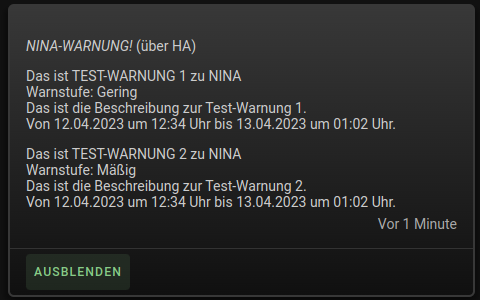
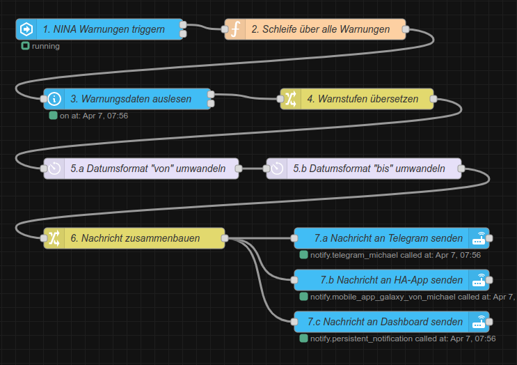
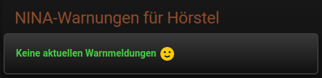
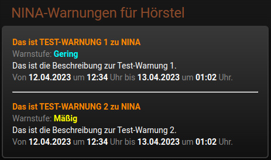

# Home Assistant - NINA Warnungen

Erweiterungen für die NINA-Integration von Home Assistant

<strong>NINA_warnings_automation_1.01.yaml</strong>
 
 
Automation zum Versenden von NINA-Warnungen an Telegram, HA-App und Dashboard
 
 

<strong>NINA_warnings_nodered_flow_1.01.json</strong>
 
 
NodeRed-Flow zum Versenden von NINA-Warnungen an Telegram, HA-App und Dashboard
 
 

<strong>NINA_warnings_dashboard_card_1.01.yaml</strong>
 
 
Dashboard-Karte zur Anzeige von NINA-Warnungen
 

 

