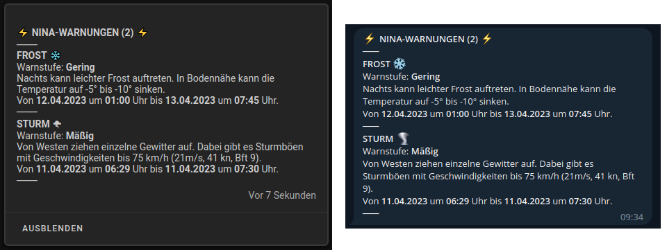
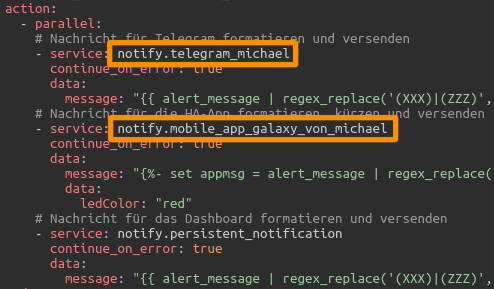

<h1>Home Assistant // NINA-Warnungen</h1>

Der Warndienst <b>NINA</b> vom <a href="https://www.bbk.bund.de/DE/Warnung-Vorsorge/Warn-App-NINA/warn-app-nina_node.html">Bundesamt für Bevölkerungsschutz und Katastrophenhilfe</a> kann auch in Home Assistant eingebunden werden. Dazu muss in den Einstellungen von Home Assistant lediglich die <a href="https://www.home-assistant.io/integrations/nina/">NINA-Integration</a> hinzugefügt werden.

<h2>Erweiterungen für die NINA-Integration von Home Assistant</h2><ul>
<li><a href="#automation">Native Automatisierung zum Versenden von NINA-Warnungen an Telegram1, HA-App2 und Dashboard</a></li>
<li><a href="#nodered">NodeRED-Flow zum Versenden von NINA-Warnungen an Telegram1, HA-App2 und Dashboard</a></li>
<li><a href="#dashboard">Dashboard-(Lovelace-)Karte zur Anzeige von NINA-Warnungen in Home Assistant</a></li>
</ul>
(1) Für den Versand von Benachrichtigungen an Telegram muss die entsprechende <a href="https://www.home-assistant.io/integrations/telegram">Telegram-Integration</a> natürlich zuvor eingerichtet sein. 
(2) Ebenso erfolgt der Versand an die HA-App natürlich auch nur, wenn diese auf dem/n Endgerät/en installiert und eingerichtet ist. 

<h3>Automatisierung zum Versenden von NINA-Warnungen an Telegram, HA-App und Dashboard (native)</h3>

<b>Quelltext</b>&nbsp;&raquo;&nbsp;<a href="https://github.com/migacode/home-assistant/blob/main/nina/code/NINA_warnings_automation.yaml"><strong>NINA_warnings_automation.yaml</strong></a> 
 
Den Quelltext wie folgt anpassen und in die <b>automations.yaml</b> kopieren. 
 
1.a. Im Bereich <i>Konfiguration</i> an der markierten Stelle den Entitäts-Namen der Sensoren durch den eigenen ersetzen. Dabei beachten, für den Eintrag <i>nina_entity_name</i> den Entitäts-Namen generisch ohne Nummern, aber mit Unterstrich am Ende zu schreiben ;) 
 

1.b. Unter <i>trigger:</i> an der markierten Stelle die Entitäts-Namen der Sensoren jeweils durch die eigenen ersetzen (diesmal die vollständigen Namen mit Nummern). 
 

1.c. Unter <i>action:</i> an den markierten Stellen die Service-Namen für die Benachrichtigungen jeweils durch die eigenen ersetzen. 
 

Selbstverständlich muss man auch nicht alle Kanäle nutzen - wer keine Benachrichtigung an Telegram, die HA-App oder das Dashboard wünscht, kann in dem Bereich <i>action:</i> die Zeilen für den jeweiligen Service einfach löschen. 
 
2. Bei Bedarf die Konfiguration (siehe Bild unter 1.a.) für den Mitteilungsversand und die Darstellung der Mitteilungen nach eigenen Wünschen anpassen. 
 
3. Nicht vergessen bei den Entwicklerwerkzeugen die Konfiguration zu prüfen und Automatisierungen neu zu laden :) 
 

<h3>NodeRED-Flow zum Versenden von NINA-Warnungen an Telegram, HA-App und Dashboard</h3>

<b>Download</b> NodeRED-Flow&nbsp;&raquo;&nbsp;<a href="https://github.com/migacode/home-assistant/blob/main/nina/code/NINA_warnings_nodered_flow_1.53.json"><strong>NINA_warnings_nodered_flow_1.53.json</strong></a> 
 
Den Quelltext/Flow in NodeRED importieren und wie folgt anpassen. 
 
1. In Node 1 (NINA-Warnungen triggern) an den markierten Stellen die Entitäts-Namen der Sensoren jeweils durch die eigenen ersetzen. 
 

2. Der Funktionsblock des Flows bietet verschiedene Möglichkeiten zur Verarbeitung und Darstellung, die individuell konfiguriert werden können. Darüber hinaus hat der Funktionsblock zwei Ausgänge: Auf dem Ersten gehen die Meldungen so raus wie konfiguriert, auf dem Zweiten gehen immer alle Meldungen raus. Beide Ausgänge liefern zur Weiterverarbeitung jeweils drei verschiedene Meldungen aus: a) voller Text mit allen Symbolen und Sonderzeichen, b) genauso nur gekürzt auf's Wesentliche und c) eine reine Textausgabe ohne Sonderzeichen für nachfolgende Nodes, die solche nicht verarbeiten können. 
Konfiguriert werden können u.a.:
<ul>
<li>Mindest-Warnstufe</li>
<li>Unterdrückung doppelter Meldungen</li>
<li>Mit oder ohne Wetter-Symbole</li>
<li>Mit oder ohne Aufhebungs-Benachrichtigung</li>
<li>Diverse andere Punkte</li>
</ul>
In Node 2 (Warnungen auslesen und Nachricht zusammenbauen) kann die Konfiguration nach eigenen Wünschen angepasst werden. 
 

3. In den Nodes 3.a bis 3.d jeweils den Service-Namen für die Benachrichtigung durch den eigenen ersetzen. 
Selbstverständlich muss man auch nicht alle Kanäle nutzen - wer keine Benachrichtigung an Telegram, die HA-App oder das Dashboard wünscht, kann den entsprechenden Node einfach löschen oder deaktivieren. 
 
<b>Hinweis</b>: Zur Unterdrückung doppelter Warnmeldungen werden bereits angezeigte Meldungen gespeichert. Um die Liste der bereits gezeigten Meldungen bei Bedarf wieder zu löschen, ist dem Flow ein entsprechender Reset-Knopf beigefügt. Die Liste wird allerdings auch automatisch gelöscht, sobald alle Warnmeldungen aufgehoben sind.

<h3>Dashboard-(Lovelace-)Karte zur Anzeige von NINA-Warnungen in Home Assistant</h3>

<b>Quelltext</b>&nbsp;&raquo;&nbsp;<a href="https://github.com/migacode/home-assistant/blob/main/nina/code/NINA_warnings_dashboard_card.yaml"><strong>NINA_warnings_dashboard_card.yaml</strong></a> 
 
Den Quelltext wie folgt anpassen und als neue Karte (manuell über YAML-Code einfügen) im Dashboard anlegen. 
 
1. An der markierten Stelle den Entitäts-Namen des Sensors durch den eigenen ersetzen. Dabei beachten, für den Eintrag <i>nina_entity_name</i> den Entitäts-Namen generisch ohne Nummern, aber mit Unterstrich am Ende zu schreiben ;) 
 

2. Wer einen anderen Ort als Hörstel verwendet, möchte vermutlich auch noch die Überschrift mit der Angabe <i>title:</i> anpassen. 
 
3. Die Schriftfarben sind für die Darstellung auf dunklem Hintergrund konfiguriert. Wer die Karte auf einem hellen Hintergrund nutzen möchte (oder andere Farben bevorzugt), kann die Farben ggf. sehr einfach durch andere RGB-Werte in den entsprechend selbsterklärenden color-Variablen anpassen. 
Darüber hinaus verwendet die Karte das HACS-Modul "card-mod", jedoch nur zur Gestaltung der Karten-Umrandung. Wer card-mod nicht verwendet, oder wem die Karte unformatiert besser gefällt, der kann die entsprechenden Style-Angaben problemlos entfernen. 
 

