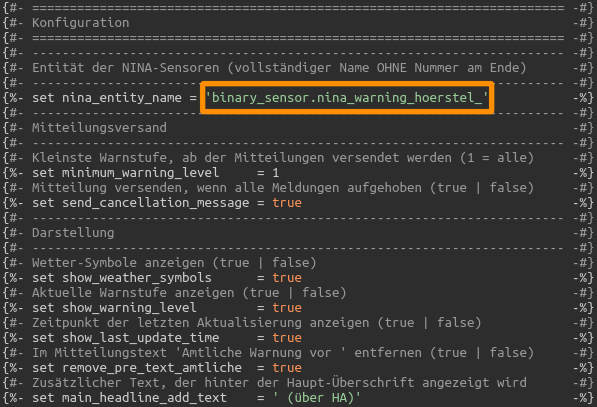
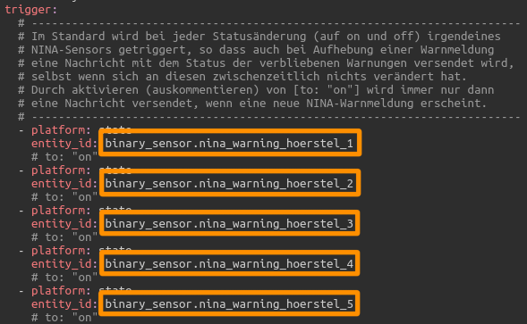
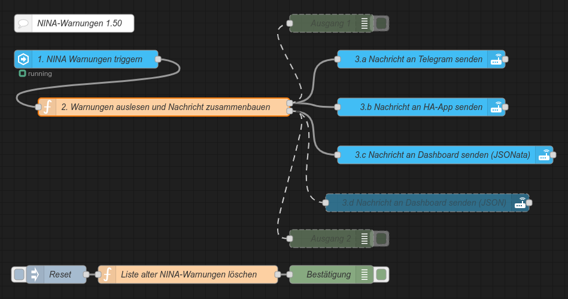

# Home Assistant // NINA-Warnungen

<strong>Erweiterungen für die <a href="https://www.home-assistant.io/integrations/nina/">NINA-Integration</a> von Home Assistant</strong> 
<ul>
<li><a href="#automation">Native Automation zum Versenden von NINA-Warnungen an Telegram1, HA-App2 und Dashboard</a></li>
<li><a href="#nodered">NodeRED-Flow zum Versenden von NINA-Warnungen an Telegram1, HA-App2 und Dashboard</a></li>
<li><a href="#dashboard">Dashboard-(Lovelace-)Karte zur Anzeige von NINA-Warnungen in Home Assistant</a></li>
</ul>
(1) Für den Versand von Benachrichtigungen an Telegram muss die entsprechende <a href="https://www.home-assistant.io/integrations/telegram">Telegram-Integration</a> natürlich zuvor eingerichtet sein. 
(2) Ebenso erfolgt der Versand an die HA-App natürlich auch nur, wenn diese auf dem/n Endgerät/en installiert und eingerichtet ist. 

<strong>Automation zum Versenden von NINA-Warnungen an Telegram, HA-App und Dashboard (native)</strong> 
 

Quelltext: <a href="https://github.com/migacode/home-assistant/blob/main/nina/code/NINA_warnings_automation.yaml">NINA_warnings_automation.yaml</a> 
 
Den Quelltext wie folgt anpassen und in die <b>automations.yaml</b> kopieren. 
 
1. An den markierten Stellen die Entitäts-Namen der Sensoren jeweils durch die eigenen ersetzen. 
Dabei beachten, für den Eintrag <i>nina_entity_name</i> den Entitäts-Namen generisch ohne Nummern, aber mit Unterstrich am Ende zu schreiben ;) 
 

2. An den markierten Stellen die Service-Namen für die Benachrichtigungen jeweils durch die eigenen ersetzen. 
 

Selbstverständlich muss man auch nicht alle Kanäle nutzen - wer keine Benachrichtigung an Telegram, die HA-App oder das Dashboard wünscht, kann in dem Bereich <i>action:</i> die Zeilen für den jeweiligen Service einfach löschen. 
 
3. Nicht vergessen bei den Entwicklerwerkzeugen die Konfiguration zu prüfen und Automatisierungen neu zu laden :) 
 

<strong>NodeRED-Flow zum Versenden von NINA-Warnungen an Telegram, HA-App und Dashboard</strong> 
 

NodeRED-Flow: <a href="https://github.com/migacode/home-assistant/blob/main/nina/code/NINA_warnings_nodered_flow.json">NINA_warnings_nodered_flow.json</a> 
 
Den Quelltext/Flow in NodeRED importieren und wie folgt anpassen. 
 
1. Im Node 1 (NINA-Warnungen triggern) an den markierten Stellen die Entitäts-Namen der Sensoren jeweils durch die eigenen ersetzen. 
 

2. In Node 2 (Warnungen auslesen und Nachricht zusammenbauen) an den markierten Stellen die Entitäts-Namen der Sensoren jeweils durch die eigenen ersetzen. Dabei beachten, für den Eintrag <i>nina_entity_name</i> den Entitäts-Namen generisch ohne Nummern, aber mit Unterstrich am Ende zu schreiben ;) 
 

3. In den Nodes 3.a und 3.b jeweils den Service-Namen für die Benachrichtigung durch den eigenen ersetzen. 
Selbstverständlich muss man auch nicht alle Kanäle nutzen - wer keine Benachrichtigung an Telegram, die HA-App oder das Dashboard wünscht, kann den entsprechenden Node (3.a, 3.b, 3.c) einfach löschen. 
 

<strong>Dashboard-(Lovelace-)Karte zur Anzeige von NINA-Warnungen in Home Assistant</strong> 
 

Quelltext: <a href="https://github.com/migacode/home-assistant/blob/main/nina/code/NINA_warnings_dashboard_card.yaml"><strong>NINA_warnings_dashboard_card.yaml</strong></a> 
 
Den Quelltext wie folgt anpassen und als neue Karte (manuell über YAML-Code einfügen) im Dashboard anlegen. 
 
1. An der markierten Stelle den Entitäts-Namen des Sensors durch den eigenen ersetzen. Dabei beachten, für den Eintrag <i>nina_entity_name</i> den Entitäts-Namen generisch ohne Nummern, aber mit Unterstrich am Ende zu schreiben ;) 
 

2. Wer einen anderen Ort als Hörstel verwendet, möchte vermutlich auch noch die Überschrift mit der Angabe <i>title:</i> anpassen. 
 
3. Die Schriftfarben sind für die Darstellung auf dunklem Hintergrund konfiguriert. Wer die Karte auf einem hellen Hintergrund nutzen möchte (oder andere Farben bevorzugt), kann die Farben ggf. sehr einfach durch andere RGB-Werte in den entsprechend selbsterklärenden color-Variablen anpassen. 
Darüber hinaus verwendet die Karte das HACS-Modul "card-mod", jedoch nur zur Gestaltung der Karten-Umrandung. Wer card-mod nicht verwendet, oder wem die Karte unformatiert besser gefällt, der kann die entsprechenden Style-Angaben problemlos entfernen. 
 

