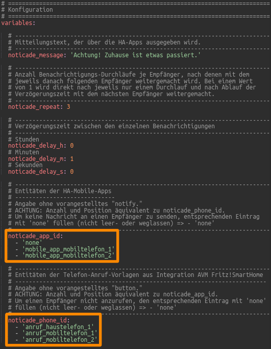

<h1>Home Assistant // Noticade - Notification Cascade<br />Benachrichtigungs-Kaskade</h1>

<b>Noticade</b> löst bei dem Auftreten eines Ereignisses eine Benachrichtigungs-Kaskade aus, bei welcher solange rollierend nacheinander verschiedene Empfänger über die HA-App und per Telefon-Anruf kontaktiert werden, wie der Zustand des auslösenden Ereignisses vorherrscht.
<b>Noticade</b> sendet Nachrichten an die HA-Apps, welche dort sowohl als Text angezeigt als auch als Sprache ausgegeben werden (Letzteres aktuell leider nur auf Geräten mit Android).<br />
Dazu verwendet <b>Noticade</b> nur die Standard-Funktionen von Home Assistant und ggf. NodeRED, es werden keine zusätzlichen Add-Ons, HACS-Module oder NodeRED-Paletten benötigt. Bei Verwendung der Telefon-Anruf-Funktion muss lediglich die Integration <b><a href="https://www.home-assistant.io/integrations/fritzbox/" target="_blank">AVM FRITZ!SmartHome</a></b> von Home Assistant installiert sein.
<hr>
<h2>Vorbereitung</h2>
Zur Ausführung benötigt <b>Noticade</b> im Grunde keine Helfer - zur Triggerung kann jede beliebige Entität verwendet werden, welche den Zustand "on" einnehmen kann (natürlich kann auch jeder andere Zustand überwacht werden, allerdings muss dies dann auch an allen relevanten Stellen im Script bzw. Flow angepasst werden.).<br />
Es wird jedoch trotzdem die Verwendung eines separaten Helfers als Trigger empfohlen, der nur bei Auftreten des eigentlich zu überwachenden Ereignisses auf "on" gesetzt wird (in den Vorlagen ist dies <i>input_boolean.ereignis_zustand</i>).
Am einfachsten erstellt man dazu einen Helfer vom Typ "Schalter" sowie eine zugehörige Automation, welche diesen Helfer auf Status "on" setzt, wenn das zu überwachende Ereigniss eintritt - etwa in der Form:<br /><br />

```yaml
triggers:
  - trigger: state
    entity_id: <ZU_ÜBERWACHENDE_ENTITÄT>
    to: <AUSLÖSENDER_STATUS_DER_ZU_ÜBERWACHENDEN_ENTITÄT>
actions:
  - action: input_boolean.turn_on
    metadata: {}
    data: {}
    target:
      entity_id: input_boolean.<ENTITÄT_DES_HELFERS>
```

Auf diese Weise kann man die Benachrichtigungs-Kaskade ggf. abschalten, selbst wenn der auslösende Zustand vielleicht noch nicht behoben ist - bspw. bei Ausfall der Heizung mit andauernder Reparatur.<br />
Sofern <b>Noticade</b> auch Telefon-Anrufe anstoßen soll, müssen dazu vorher in einer FRITZ!Box im Bereich "Smart Home" entsprechende Vorlagen für automatische Anrufe erstellt werden. Wie das in der FRITZ!Box geht, kann man sich &nbsp;&raquo;&nbsp;<a href="./fb_smarthome_vorlage_anruf.md" target="_blank">hier</a> ansehen.<br />
<span style="float:left;">Vorlagen für automatische Anrufe in der FRITZ!Box erstellen&nbsp;&raquo;&nbsp;</span><a href="./fb_smarthome_vorlage_anruf.md" target="_blank"></a><br />
<br />
<hr>
<h2>Noticade für Home Assistant (Varianten)</h2>
Zur Integration von <b>Noticade</b> in Home Assistant stehen zwei Varianten zur Verfügung, so dass sich jeder seine bevorzugte Variante aussuchen kann.<br /><ul>
<li><a href="#automation">Native Automation (Yaml-Code)</a></li>
<li><a href="#nodered_flow">NodeRED-Flow (mit JavaScript-Funktionsblock)</a></li>
</ul>

<a id="automation"></a>
<hr>
<h3>Automation (native)</h3>
<b>Quelltext</b>&nbsp;&raquo;&nbsp;<a href="https://github.com/migacode/home-assistant/blob/main/noticade/code/noticade_1.10.yaml"><strong>noticade_1.10.yaml</strong></a><br />
<br />
Den Quelltext in die <b>automations.yaml</b> kopieren und wie folgt ändern.<br /><br />
<b>1.</b> Im Bereich "Konfiguration / variables" alle Parameter gemäß eigenen Vorstellungen anpassen.<br />
In der Voreinstellung werden 3 mal nacheinander jeweils im Abstand von einer Minute Benachrichtigungen an den selben Empfänger versendet, bevor mit dem nächsten Empfänger auf gleiche Weise weiter gemacht wird. Nach dem letzten Empfänger wird automatisch wieder mit dem ersten Empfänger begonnen.<br /><br />

Exemplarisch sind für drei Empfänger die Entitäten der HA-Apps und Telefon-Anruf-Vorlagen angelegt, welche durch die eigenen ersetzt werden müssen. Wenn weniger benötigt werden, können die entsprechenden Zeilen einfach gelöscht werden, wenn mehr benötigt werden, einfach weitere Zeilen nach gleichem Schema hinzufügen.<br />
<b>Achtung:</b> Es ist darauf zu achten, dass die Anzahl der Einträge in den beiden Listen für die HA-Apps und Anruf-Vorlagen identisch sind.<br />
Wenn für einen Empfänger keine HA-App-Benachrichtigung oder kein Anruf erfolgen soll, ist in dem entsprechenden Eintrag das Wort <i>none</i> (klein geschrieben) einzutragen.<br /><br />
<b>2.</b> Sämtliche Vorkommen von <i>input_boolean.ereignis_zustand</i> mit der Entität des eigenen zu überwachenden Sensors bzw. Helfers ersetzen.<br />
Dies ist leider erforderlich, weil die Entitäts-ID bei Triggern in Automationen von Home Assistant derzeit leider noch nicht Template-fähig ist.<br />
Gegebenenfalls kann an diesen Stellen auch der zu überwachende Status des Sensors angepasst werden (bspw. '<i>off</i>' statt '<i>on</i>').<br /><br />
Zuletzt nicht vergessen bei den Entwicklerwerkzeugen die Konfiguration zu prüfen und Automationen neu zu laden. :)<br /><br />

<a id="nodered_flow"></a>
<hr>
<h3>NodeRED-Flow</h3>

<b>Download</b> NodeRED-Flow&nbsp;&raquo;&nbsp;<a href="https://github.com/migacode/home-assistant/blob/main/noticade/code/noticade_nodered_flow_1.10.json"><strong>noticade_nodered_flow_1.10.json</strong></a><br />
<br />
Den Quelltext/Flow in NodeRED importieren und wie folgt anpassen.<br />
<br />
<b>1.</b> In Node "Ereignis (Zustand)" die Entität durch die gewünschte zu überwachende Entität bzw. einen entsprechenden Helfer ersetzen.<br /><br />

<br />

<b>2.</b> In Node "Initalisierung" im Bereich "Konfiguration" die dort vorhandenen Werte gemäß den eigenen Wünschen anpassen.<br />
In der Voreinstellung werden 3 mal nacheinander jeweils im Abstand von 60 Sekunden Benachrichtigungen an den selben Empfänger versendet, bevor mit dem nächsten Empfänger auf gleiche Weise weiter gemacht wird. Nach dem letzten Empfänger wird automatisch wieder mit dem ersten Empfänger begonnen.
Exemplarisch sind für drei Empfänger die Entitäten der HA-Apps und Telefon-Anruf-Vorlagen angelegt, welche durch die eigenen ersetzt werden müssen. Wenn weniger benötigt werden, können die entsprechenden Zeilen einfach gelöscht werden, wenn mehr benötigt werden, einfach weitere Zeilen nach gleichem Schema hinzufügen.<br />
<br />
<b>Achtung:</b> Es ist darauf zu achten, dass die Nummerierung bei 0 anfängt und kontinuierlich sein muss, also keine Nummer zu überspringen ist.<br />
Zudem muss die Anzahl der Einträge in den beiden Listen für die HA-Apps und Anruf-Vorlagen identisch sein.<br />
Wenn für einen Empfänger keine HA-App-Benachrichtigung oder kein Anruf erfolgen soll, ist in dem entsprechenden Eintrag das Wort <i>none</i> einzutragen.<br />
<br />

<br />
<hr>
<b>Viel Erfolg!</b>
