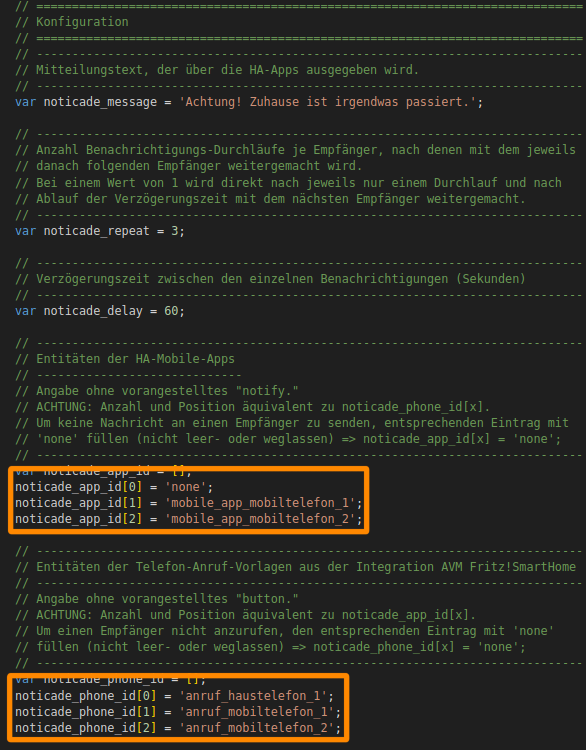

<h1>Home Assistant // Noticade - Notification Cascade - Benachrichtigungs-Kaskade</h1>

<b>Noticade</b> löst bei dem Auftreten eines Ereignisses eine Banachrichtigungs-Kaskade aus, bei welcher nacheinander verschiedene Empfänger über die HA-App und per Telefon-Anruf kontaktiert werden.
<b>Noticade</b> sendet Nachrichten dazu an die HA-App, welche dort sowohl als Text angezeigt als auch als Sprache ausgegeben werden (Letzteres aktuell leider nur auf Android).
Dazu verwendet <b>Noticade</b> nur die Standard-Funktionen von Home Assistant und ggf. NodeRED, es werden keine zusätzlichen Add-Ons, HACS-Module oder NodeRED-Paletten benötigt. Bei Verwendung der Telefon-Anruf-Funktion muss die Integration <a src="https://www.home-assistant.io/integrations/fritzbox/" target="_blank">AVM FRITZ!SmartHome</a> installiert werden.

<h2>Vorbereitung</h2>
Zur Ausführung benötigt <b>Noticade</b> keine Helfer - zur Triggerung kann jede beliebige Entität verwendet werden, welche den Zustand "on" einnehmen kann (natürlich kann auch jeder andere Zustand überwacht werden, allerdings muss dies dann auch an allen relevanten Stellen im Script bzw. Flow angepasst werden.). 
Es wird jedoch trotzdem die Verwendung eines separaten Helfers als Trigger empfohlen, der nur bei Auftreten des eigentlich zu überwachenden Ereignisses auf "on" gesetzt wird. Auf diese Weise kann man die Benachrichtigungs-Kaskade ggf. abschlaten, selbst wenn der auslösende Zustand vielleicht noch nicht behoben ist (bspw. Heizungsaufall).
Sofern <b>Noticade</b> auch Telefon-Anrufe anstoßen soll, müssen dazu allerdings vorher in einer FRITZ!Box im Bereich "Smart Home" auch noch entsprechende Vorlagen für automatische Anrufe erstellt werden. Wie das geht, kann man sich &nbsp;&raquo;&nbsp;<a href="https://github.com/migacode/home-assistant/blob/main/noticade/img/fb_smarthome_vorlage_anruf_erstellen.png">hier</a> ansehen.
Zur Integration von <b>Noticade</b> in Home Assistant stehen zwei Varianten zur Verfügung, so dass sich jeder seine bevorzugte Variante aussuchen kann.
 

<h2>Noticade für Home Assistant (Varianten)</h2><ul>
<li><a href="#automation">Native Automatisierung (Yaml-Code)</a></li>
<li><a href="#nodered_flow">NodeRED-Flow (mit JavaScript-Funktionsblock)</a></li>
</ul>

<h3>Automatisierung (native)</h3>
<b>Quelltext</b>&nbsp;&raquo;&nbsp;<a href="https://github.com/migacode/home-assistant/blob/main/noticade/code/noticade_1.00.yaml"><strong>noticade_1.00.yaml</strong></a> 
 
Den Quelltext wie folgt anpassen und in die <b>automations.yaml</b> kopieren (siehe dazu auch den Absatz <a href="#konfiguration">Konfiguration<a>). 
 
1. Das Intervall im Absatz <i>trigger:</i> unter der Platform <i>time_pattern</i> auf die gewünschten Werte einstellen. 
 
2. Die Verzögerung im Absatz <i>action:</i> unter <i>delay:</i> auf die gewünschten Werte einstellen. 
 
3. Nicht vergessen bei den Entwicklerwerkzeugen die Konfiguration zu prüfen und Automatisierungen neu zu laden :) 
 

<h3>NodeRED-Flow</h3>

<b>Download</b> NodeRED-Flow&nbsp;&raquo;&nbsp;<a href="https://github.com/migacode/home-assistant/blob/main/noticade/code/noticade_nodered_flow_1.00.json"><strong>noticade_nodered_flow_1.00.json</strong></a> 
 
Den Quelltext/Flow in NodeRED importieren und wie folgt anpassen. 
 
1. In Node "Ereignis (Zustand)" die Entität durch die gewünschte zu überwachende Entität bzw. einen entsprechenden Helfer ersetzen.  

 
2. In Node "Initalisierung" im Bereich "Konfiguration" die dort vorhandenen Werte gemäß den eigenen Wünschen anpassen.. 
In der Voreingestellung werden je Empfänger 3 mal jeweils im Abstand von 60 Sekunden Benachrichtigung versendet. In der
  

 

