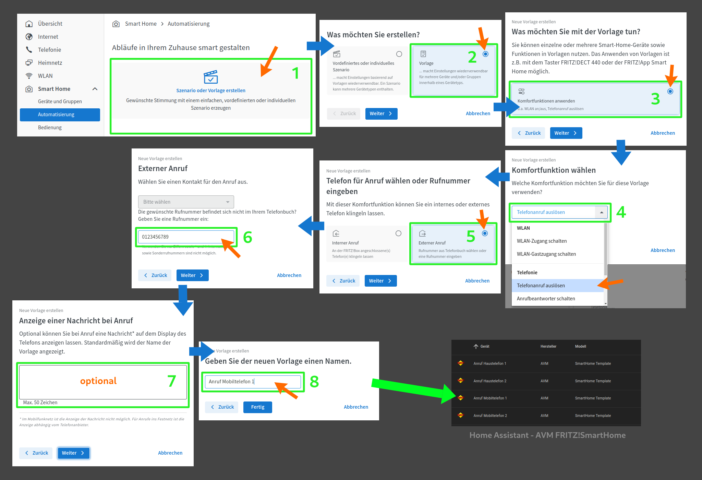

<h1>Home Assistant // AVM FRITZ!SmartHome Vorlage Telefon-Anruf erstellen</h1>

Anleitung zur Erstellung von Vorlagen für Telefon-Anrufe in der FRITZ!Box zur Verwendung als Template in Home Assistant</b>.

Mit dem nachstehend dargestellten Verfahren kann man in den Einstellungen der FRITZ!Box bei <b>Smart Home" -> Automatisierung</b> Vorlagen für Telefon-Anrufe erstellen. Diese werden dann in Home Assistant automatisch durch die Integration <b>AVM FRITZ!SmartHome</b> bereit gestellt und können dort genutzt werden, um über Home Assistant Telefon-Anrufe zu initiieren. 
<b>Hinweis:</b> Derzeit wird von der FRITZ!Box nur ein Klingeln der Telefone eingeleitet, bei Rufannahme legt die FRITZ!Box sofort auf - es werden keine Ansagen oder gar Gespräche unterstützt. 
 

 
Zurück zu </b>&nbsp;&raquo;&nbsp;<a href="https://github.com/migacode/home-assistant/tree/main/noticade"><strong>Noticade</strong></a>
 
 

<b>Viel Erfolg!</b>
