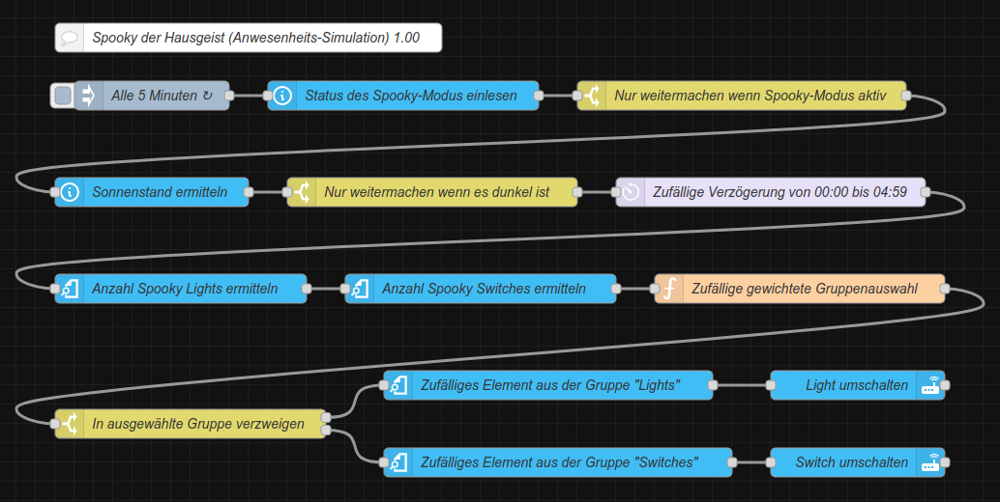

<h1>Home Assistant // Spooky Anwesenheits-Simulation</h1>

Nur mit Standard-HA- bzw. NodeRED-Funktionen (ohne zusätzliche Integrationen, Add-Ons, HACS oder NodeRED-Paletten)

NodeRED etwas komplizierter, weil kein automatisiert parametrisierbarer Zufallsgenerator und Umschalten nur mit Angabe der Domain, daher Random per JavaScript-Funktion und Toggle getrennt nach Gruppe.

1.) HA-Helfer anlegen (genau so schreiben oder sonst auch in Automation/Flow anpassen)

- Schalter "Spookymode" (input_boolean.spookymode) zur einfachen (De-)Aktivierung der Automatisierung

- Gruppe "Spooky Lights" (light.spooky_lights) mit allen einzubeziehenden Lichtern

- Gruppe "Spooky Switches" (switch.spooky_switches) mit allen einzubeziehenden Schaltern

(HA schaltet Gruppen nur innerhalb einer Domain, daher Trennung nach Domain lights und Domain switches)

2.) Native Automation oder NodeRED-Flow importieren

3.) Bei Bedarf trigger->time_pattern und action->delay anpassen
Das triggernde time_pattern-Intervall ist abhängig von der Anzahl der Geräte und dem gewünschten Zeitabstand der Schaltvorgänge.
Beispiel: Bei einer Taktung von 5 Minuten und 4 Geräten wird jedes Gerät durchschnittlich alle 20 Minutes je nach dessen aktuellem Status ein- oder ausgeschaltet.
20 Minuten / 4 Geräte = 5

4.) Dashboard-Karte mit Schalter für input_boolean.spookymode anlegen

5.) Spooky-Modus einschalten ... enjoy ;)

<h2>Spooky der Hausgeist für Home Assistant</h2><ul>
<li><a href="#automation">Native Automatisierung</a></li>
<li><a href="#nodered">NodeRED-Flow</a></li>
</ul>

<h3>Automatisierung (native)</h3>
Quelltext&nbsp;&raquo;&nbsp;<a href="https://github.com/migacode/home-assistant/blob/main/spooky/code/spooky_automation.yaml">spooky_automation.yaml</a> 
 
Den Quelltext wie folgt anpassen und in die <b>automations.yaml</b> kopieren. 
 
1. ... 
 
 
2. Nicht vergessen bei den Entwicklerwerkzeugen die Konfiguration zu prüfen und Automatisierungen neu zu laden :) 
 

<h3>NodeRED-Flow</h3>

NodeRED-Flow&nbsp;&raquo;&nbsp;<a href="https://github.com/migacode/home-assistant/blob/main/spooky/code/spooky_nodered_flow.json">spooky_nodered_flow.json</a> 
 
Den Quelltext/Flow in NodeRED importieren und wie folgt anpassen. 
 
1. In Node 1 ... 
 
2. In Node 2 ... 
 

