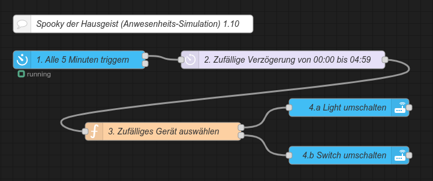
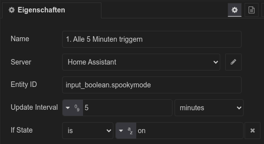
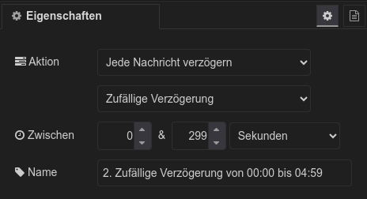
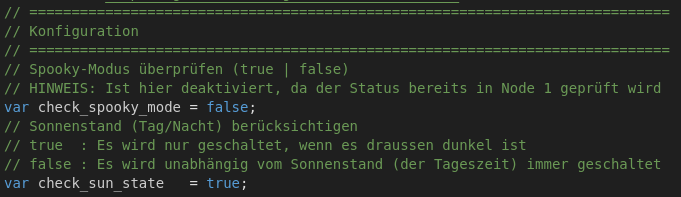

<h1>Home Assistant // Spooky  Anwesenheits-Simulation</h1>

<b>Spooky der Hausgeist</b> ist eine einfache Anwesenheits-Simulation für Home Assistant. Dabei werden in regelmäßigen Abständen mit zufälligem zeitlichen Versatz frei definierbare Geräte wie Lampen, TV oder Radios zufällig ein- und ausgeschaltet.
Dazu verwendet <b>Spooky</b> nur die Standard-Funktionen von Home Assistant und ggf. NodeRED, es werden keine zusätzlichen Integrationen, Add-Ons, HACS-Module oder NodeRED-Paletten benötigt.
Zur Integration von <b>Spooky</b> in Home Assistant stehen zwei Varianten zur Verfügung, so dass sich jeder seine bevorzugte Variante aussuchen kann.

<h2>Vorbereitung</h2>
Zur Ausführung benötigt <b>Spooky</b> die folgenden Helfer, welche vorher in Home Assistant angelegt werden müssen.
Diese bei der Anlage am besten genau so schreiben wie angegeben, damit die Entitäten auch so wie in den Klammern stehend erzeugt werden - ansonsten können diese natürlich auch nachträglich manuell angepasst werden.<ul>
<li>Schalter "Spookymode" (input_boolean.spookymode) zur De-/Aktivierung der Automatisierung</li>
<li>Licht-Gruppe "Spooky Lights" (light.spooky_lights) mit allen einzubeziehenden smarten Leuchtmitteln</li>
<li>Schalter-Gruppe "Spooky Switches" (switch.spooky_switches) mit allen sonstigen einzubeziehenden Geräten</li>
</ul>
<b>Wichtig</b>: Es müssen beide Helfer-Gruppen angelegt werden, selbst wenn einer davon keine Geräte zugeordnet werden. Spooky erkennt automatisch, ob die Gruppe leer ist. 
 
Idealerweise sollte man sich dann auch eine Dashboard-Karte mit einem Schalter für den <b>Spookymode</b> (input_boolean.spookymode) anlegen, um <b>Spooky</b> bequem über die Benutzeroberfläche von Home Assistant ein- und ausschalten zu können. 
Wer ein passendes Icon dazu sucht -> <i>mdi:ghost</i> 

<h2>Spooky der Hausgeist für Home Assistant (Varianten)</h2><ul>
<li><a href="#automation">Native Automatisierung (Yaml-Code)</a></li>
<li><a href="#nodered_flow">NodeRED-Flow (mit JavaScript-Funktionsblock)</a></li>
</ul>

<h3>Automatisierung (native)</h3>
Quelltext&nbsp;&raquo;&nbsp;<a href="https://github.com/migacode/home-assistant/blob/main/spooky/code/spooky_automation.yaml">spooky_automation.yaml</a> 
 
Den Quelltext wie folgt anpassen und in die <b>automations.yaml</b> kopieren (siehe dazu auch den Absatz <a href="#konfiguration">Konfiguration<a>). 
 
1. Das Intervall im Absatz <i>trigger:</i> unter der Platform <i>time_pattern</i> auf die gewünschten Werte einstellen. 
 
2. Die Verzögerung im Absatz <i>action:</i> unter <i>delay:</i> auf die gewünschten Werte einstellen. 
 
3. Nicht vergessen bei den Entwicklerwerkzeugen die Konfiguration zu prüfen und Automatisierungen neu zu laden :) 
 

<h3>NodeRED-Flow</h3>

NodeRED-Flow&nbsp;&raquo;&nbsp;<a href="https://github.com/migacode/home-assistant/blob/main/spooky/code/spooky_nodered_flow_1.10.json">spooky_nodered_flow_1.10.json</a> 
 
Den Quelltext/Flow in NodeRED importieren und wie folgt anpassen (siehe dazu auch den Absatz <a href="#konfiguration">Konfiguration<a>). 
 
1. Das Zeitintervall in Node 1 auf die gewünschten Werte einstellen.  

 
2. Die Verzögerung in Node 2 auf die gewünschten Werte einstellen. 
Hier ist eine Zeitspanne anzugeben, aus der ein zufälliger Wert erzeugt wird, welche Node 2 wartet, bis dieser an Node 3 weiterleitet. Idealerweise beträgt der Maximalwert für die Zeitspanne daher den Wert des Intervalls aus Node 1 in Sekunden minus 1 Sekunde. Beispielsweise bei 5 Minuten (300 Sekunden) in Node 1 also eine Spanne zwischen 0 & 299 Sekunden in Node 2.  

 
3. Bei Bedarf kann zudem in Node 3 im Abschnitt Konfiguration angegeben werden, ob die Prüfungen des Spooky-Modus und des Sonnenstands innerhalb des Funktionsblocks erfolgen sollen oder nicht - bspw. wenn diese in einem eigenen Flow an anderer Stelle in einem vorgelagerten Node erfolgen.  

<h2>Konfiguration</h2>
<b>Spooky</b> ist so vorkonfiguriert, dass die Umschaltung der Geräte nur bei Dunkelheit erfolgt (zwischen Sonnenuntergang und Sonnenaufgang) - diese sowie weitere Bedingungen können natürlich leicht geändert und erweitert werden.
<h3>Zeitabstände</h3>
Der Zeitabstand der Schaltvorgänge kann durch die Parameter Intervall (time_pattern) und Verzögerung (delay) bzw. bei den NodeRED-Flows in den entsprechenden Nodes eingestellt werden.
Beispiel: Wenn 4 Geräte durchschnittlich alle 20 Minuten ein- oder ausgeschaltet werden sollen, sollte das Intervall 5 Minuten (20 / 4 = 5) betragen.
Damit verdächtigerweise nicht genau alle 5 Minuten etwas passiert, kann und sollte zusätzlich ein zeitlicher Versatz definiert werden, welcher als Maximalwert idealerweise fast genauso groß ist wie das Intervall selbst (siehe Beispiel oben).
