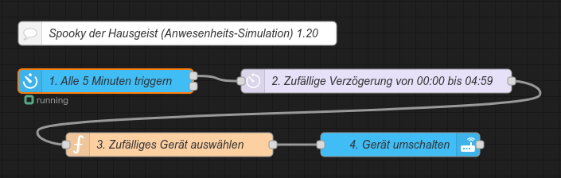

<h1>Home Assistant // Spooky der Hausgeist (Anwesenheits-Simulation)</h1>

Die Integration des Warndienstes des <a href="https://www.dwd.de/">Deutschen Wetterdienst</a> (DWD) erfolgt manuell in der <b>configuration.yaml</b> durch Anlage eines Sensors (hier als Beispiel für die Stadt Hörstel).<br/>
```yaml
sensor:
  - platform: dwd_weather_warnings
    name: DWD-Warnungen Hoerstel
    region_name: 805566016
```
<hr>
<h2>Anwesenheits-Simulation für Home Assistant</h2><ul>
<li><a href="#automation">Native Automatisierung</a></li>
<li><a href="#nodered">NodeRED-Flow</a></li>
</ul>

<a id="automation"></a>
<hr>
<h3>Automatisierung (native)</h3>
Quelltext&nbsp;&raquo;&nbsp;<a href="https://github.com/migacode/home-assistant/blob/main/spooky/code/spooky_automation.yaml">spooky_automation.yaml</a><br />
<br />
Den Quelltext wie folgt anpassen und in die <b>automations.yaml</b> kopieren.<br />
<br />
1. ...<br />
<br />
<br />
2. Nicht vergessen bei den Entwicklerwerkzeugen die Konfiguration zu prüfen und Automatisierungen neu zu laden :)<br />
<br />

<a id="nodered"></a>
<hr>
<h3>NodeRED-Flow</h3>

NodeRED-Flow&nbsp;&raquo;&nbsp;<a href="https://github.com/migacode/home-assistant/blob/main/spooky/code/spooky_nodered_flow.json">spooky_nodered_flow.json</a><br />
<br />
Den Quelltext/Flow in NodeRED importieren und wie folgt anpassen.<br />
<br />
1. In Node 1 ...<br />
<br />
2. In Node 2 ...<br />
<br />

<hr>
