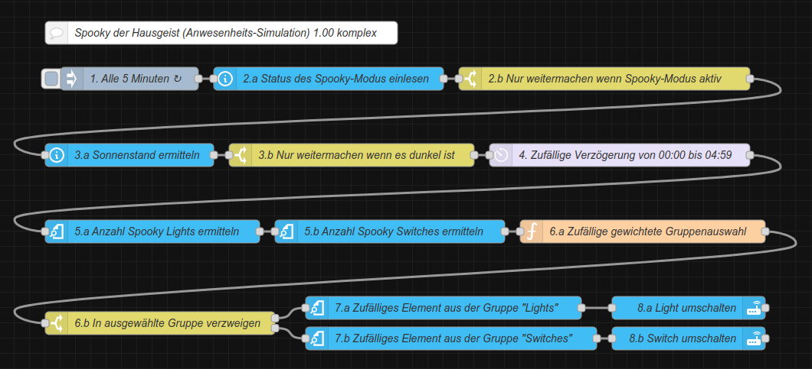

<h1>Home Assistant // Spooky Anwesenheits-Simulation</h1>

<b>Spooky der Hausgeist</b> ist eine einfache Anwesenheits-Simulation für Home Assistant. Dabei werden in regelmäßigen Abständen mit zufälligem zeitlichen Versatz zufällig frei definierbare Geräte wie Lampen, TV oder Radios ein- und ausgeschaltet.
Dazu verwendet <b>Spooky</b> nur die Standard-Funktionen von Home Assistant und ggf. NodeRED, es werden keine zusätzlichen Integrationen, Add-Ons, HACS-Module oder NodeRED-Paletten benötigt.
Zur Integration von <b>Spooky</b> in Home Assistant stehen drei Varianten zur Verfügung, welche sich funktional nicht unterscheiden, so dass sich jeder seine bevorzugte Variante aussuchen kann.
Wobei die NodeRED-Flows deutlich komplexer sind, weil NodeRED im Standard über keinen automatisiert parametrisierbaren Zufallsgenerator verfügt, und das Umschalten von Entitäten nur mit expliziter Angabe der Domain erlaubt. Daher wird in den NodeRED-Flows der Zufallsgenerator per JavaScript-Funktion umgesetzt, und die Umschaltung getrennt nach Gruppen (Domains) verarbeitet.

<h2>Spooky der Hausgeist für Home Assistant</h2><ul>
<li><a href="#automation">Native Automatisierung (Yaml-Code)</a></li>
<li><a href="#nodered-komplex">NodeRED-Flow komplex (Verarbeitung mit Nodes, nur Zufallsgenerator in JavaScript)</a></li>
<li><a href="#nodered-kompakt">NodeRED-Flow kompakt (Großteil der Verarbeitung in einem JavaScript-Funktionsblock)</a></li>
</ul>

Zur Ausführung benötigt <b>Spooky</b> noch die folgenden Helfer, welche vorher in Home Assistant angelegt werden müssen.
Diese bei der Anlage am besten genau so schreiben wie angegeben, damit die Entitäten auch so wie in den Klammern stehend erzeugt werden - ansonsten können diese natürlich auch nachträgliuch manuell angepasst werden.<ul>
<li>Schalter "Spookymode" (input_boolean.spookymode) zur einfachen (De-)Aktivierung der Automatisierung</li>
<li>Licht-Gruppe "Spooky Lights" (light.spooky_lights) mit allen einzubeziehenden Lichtern</li>
<li>Schalter-Gruppe "Spooky Switches" (switch.spooky_switches) mit allen einzubeziehenden Schaltern</li>
</ul>

Idealerweise sollte man sich Dashboard-Karte mit einem Schalter für input_boolean.spookymode anlegen.

<h3>Automatisierung (native)</h3>
Quelltext&nbsp;&raquo;&nbsp;<a href="https://github.com/migacode/home-assistant/blob/main/spooky/code/spooky_automation.yaml">spooky_automation.yaml</a> 
 
Den Quelltext wie folgt anpassen und in die <b>automations.yaml</b> kopieren (siehe dazu auch den Absatz <a href="#konfiguration">Konfiguration<a>). 
 
1. Intervall ... 
 
2. Verzögerung ... 
 
3. Nicht vergessen bei den Entwicklerwerkzeugen die Konfiguration zu prüfen und Automatisierungen neu zu laden :) 
 

<h3>NodeRED-Flow komplex</h3>

NodeRED-Flow&nbsp;&raquo;&nbsp;<a href="https://github.com/migacode/home-assistant/blob/main/spooky/code/spooky_nodered_flow_komplex.json">spooky_nodered_flow_komplex.json</a> 
 
Den Quelltext/Flow in NodeRED importieren und wie folgt anpassen (siehe dazu auch den Absatz <a href="#konfiguration">Konfiguration<a>). 
 
1. Intervall ... 
 
2. Verzögerung ... 
 

<h3>NodeRED-Flow kompakt</h3>

NodeRED-Flow&nbsp;&raquo;&nbsp;<a href="https://github.com/migacode/home-assistant/blob/main/spooky/code/spooky_nodered_flow_kompakt.json">spooky_nodered_flow_kompakt.json</a> 
 
Den Quelltext/Flow in NodeRED importieren und wie folgt anpassen (siehe dazu auch den Absatz <a href="#konfiguration">Konfiguration<a>). 
 
1. Intervall ... 
 
2. Verzögerung ... 
 

<h2>Konfiguration</h2>
Spooky ist so vorkonfiguriert, dass die Umschaltung der Geräte nur bei Dunkelheit erfolgt (zwischen Sonnenuntergang und Sonnenaufgang) - dies sowie weitere Bedingungen können natürlich leicht geändert und erweitert werden.
<h3>Zeitabstände</h3>
Der Zeitabstand der Schaltvorgänge kann durch die Parameter Intervall (time_pattern) und Verzögerung (delay) bzw. bei den NodeRED-Flows in den entsprechenden Nodes eingestellt werden.
Beispiel: Wenn 4 Geräte durchschnittlich alle 20 Minuten ein- oder ausgeschaltet werden sollen, sollte das Intervall 5 Minuten (20 / 4 = 5) betragen.
Damit verdächtigerweise nicht genau alle 5 Minuten etwas passiert, kann und sollte zusätzlich ein zeitlicher Versatz definiert werden, welcher als Maximalwert idealerweise fast genauso groß ist wie das Intervall selbst.
