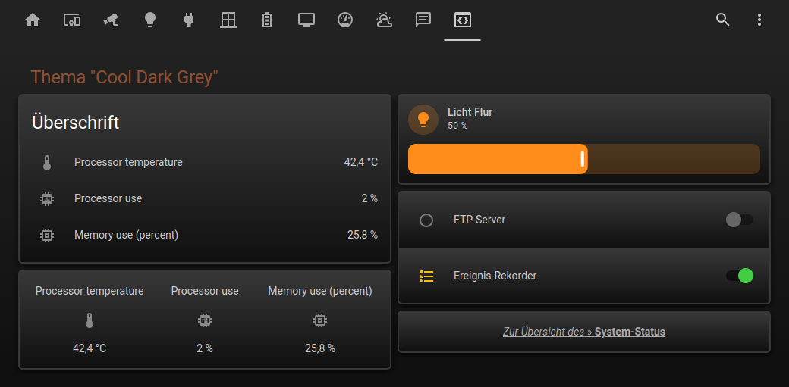
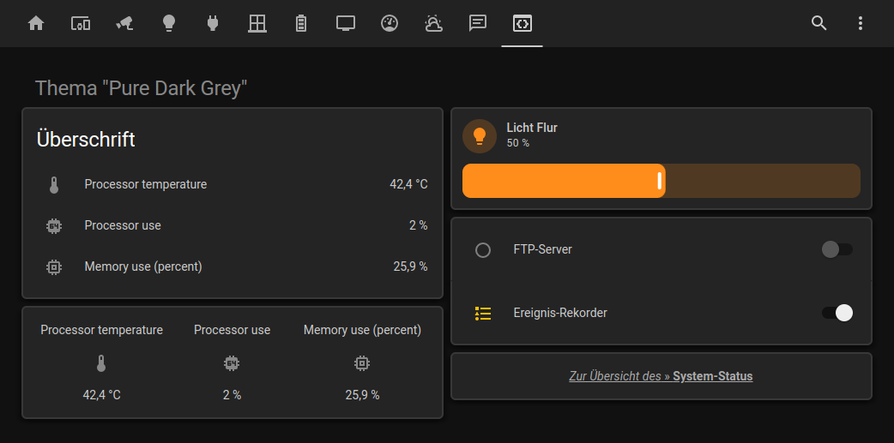
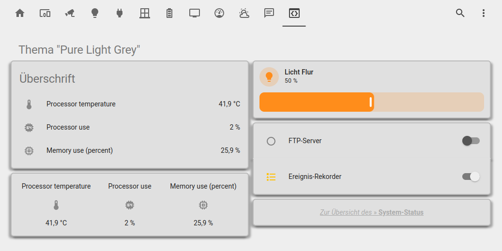

# Home Assistant Themen

Für alle, die gerne eine weniger bunte Benutzeroberfläche in Home Assistant möchten, habe ich die folgenden Themen erstellt.
Die Farben für die Einstellung von Lichtern sowie die Statusanzeigen von Entitäten bleiben dabei selbstverständlich erhalten.
Darüber hinaus sind die Themen unabhängig von den Einstellungen des Browsers, d.h. sie sehen identisch aus, egal ob der Browser auf hell oder dunkel eingestellt ist.

Zur Einbindung einfach die Datei <a href="https://github.com/migacode/home-assistant/blob/main/themes/themes-grey.yaml">themes-grey.yaml</a> in das Verzeichnis <b>/config</b> kopieren und in der Datei <b>configuration.yaml</b> folgendes eintragen (falls der Absatz <b>fronted:</b> bereits vorhanden ist, natürlich nur den <b>themes:</b>-Eintrag darunter hinzufügen.

```yaml
frontend:
  themes: !include themes-grey.yaml
```

Wie bei jeder Konfigurationsänderung muss zur Aktivierung der Themen Home Assistant leider neu gestartet werden.
Die neuen Themen stehen danach bei den entsprechenden Einstellungen zur Auswahl.

<hr>
<b>Previews</b><br /><br />



